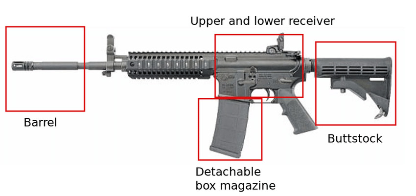

https://www.youtube.com/watch?v=x8keXO3WEEk

Here's a surprising statistic that I recently learned about: **the large majority of all mass public shootings have occurred in areas that are supposed to be "gun-free"**. My goal with this article is to figure out if this is **true or not**, and to do my own extensive research based on the largest shootings that have occurred in the US.

Let's first look at the stats, and then we can decide on our opinion.

Let's pick 1990 as an arbitrary start date to this analysis. Since then, the US has had XXX mass shootings. What is a mass shooting? It is ...

Now what about mass murder? THere have been XXX mass murders since 1990.

How many people have been killed with guns? XXX

How many of those are suicides? XXX

parkland shooting
el paso shooting
uvalde shooting
Lewiston shooting
nashville
fort hood
sandy hook
virginia tech (all mentally ill ppl?)
sutherland springs church shooting
2019 dayton shooting

greenwood park mall shooting
2022 Sacramento shooting

cases where a ivilian killed the attacker

check how did the attacker get the gun

| Location and Date | State Color | Weapon(s) Used | Deaths/Inj | Perpetrator's Background | Reason | How did it stop? |
| ----------- | ----------- | ----------- | ----------- | ----------- | ----------- | ----------- | 
| 2017 Las Vegas, Nevada | Blue | 24 firearms brought to the hotel room in total, out of which 15 were used. 14 of them were .223-caliber AR-15-type semi-automatic rifles, and 8 of them were .308-caliber AR-10-type rifles. Some of the AR-15's were fitted with a bump stock. He brought ammo for days, as well as numerous high-capacity magazines capable of holding up to 100 rounds apiece. Just over 1000 rounds were fired in total. | 60/800+ | Stephen Paddock, 64 white man whose father was on FBI's most-wanted list in the 1970's.... The firearms found in his hotel room, along with more guns found in his homes, had been legally purchased in Nevada, California, Texas, and Utah.| reason asd asd asd asjdkaskdbjkabskdn jkasdjka jksbdjkasjkd jkasdn jkans djknd| How did it stop ksjdbhkasbdhb ahbsdk bajksbdjk asjkdbk baskdb kasdkj |
| 2019 Gilroy Garlic Festival, California | Blue | weapon | deat/inj | bkgr | reason | How did it stop |
| 2022 Highland Park parade, Illinois | Blue | weapon | 7/48 | 21 year old white male. He was arrested 8 hours after the shooting. It was during a July 4th celebration. | reason asd asd asd asjdkaskdbjkabskdn jkasdjka jksbdjkasjkd jkasdn jkans djknd| How did it stop ksjdbhkasbdhb ahbsdk bajksbdjk asjkdbk baskdb kasdkj |
| 1993 Brown's Chicken massacre, Illinois | Blue | weapon | deat/inj | bkgr | reason | How did it stop |
| 2012 Sandy Hook Elementary School Shooting, Newtown, Connecticut | Blue | .223-caliber AR-15-type semi-automatic rifle  | 27/2. 20 children b/w the ages 6-7, 6 were school staff,and 1 was the perpetrator's mother at home. | bkgr | reason | How did it stop |

## Evolution of the Law

### Are fully-automatic weapons legal in the US?

In the United States, fully automatic firearms are legal but heavily regulated.  Individuals wishing to own a fully automatic firearm must undergo an extensive background check by the ATF, pay a special tax, and register the weapon with the ATF. The 1986 Firearm Owners' Protection Act also prohibits the civilian ownership of any fully automatic firearms manufactured after May 19, 1986. As a result, legally owned automatic firearms are typically older models and are relatively rare and expensive due to these restrictions.

### Bump Stocks

Let's imagine a semi-automatic AR-15 style rifle. The thing that you rest on your chest when shooting is called a buttstock. 

<!--  -->

Simply put, a bump stock is a modified buttstock which makes it so that a semi-automatic gun could functions like an automatic one. You can watch how it [works in slow motion here](https://youtu.be/u0rwqH3YL5c?si=OX5o9jHLuRkzKoEG&t=336). Basically, while your finger stays put, the gun's recoil makes the gun move forward and backward, thus making the trigger move towards your finger.

The ATF (United States Bureau of Alcohol, Tobacco, Firearms and Explosives), which is the agency within the DOJ which, among other things, deals with investigating and preventing offenses involving firearms and explosives, ruled in 2010 that bump stocks were not a firearm part subject to regulation and allowed their sale as an unregulated firearm part.

> I must mention however, that although bump stocks were legal at a federal level, states can enact laws that are stricter than federal laws. For example, even if a type of firearm or accessory (like a bump stock) is legal under federal law, a state can choose to ban it. However, a state cannot make legal something that is prohibited by federal law. Whichever is stricter is the one that is in effect. 

Bump stocks have been illegal in California since 1990 and in New York since 2013.

Following the 2017 Las Vegas shooting, as well as the 2018 Parkland school shooting, multiple states (Massachusetts, New Jersey, Vermont, Maryland, Florida, Washington, Hawaii, Nevada, Delaware, Rhode Island and Connecticut) enacted bans on bump stocks.

The ban went into effect in 2019, by which owners of bump stocks were required to destroy them or surrender them to ATF, punishable by 10 years imprisonment and a $250,000 fine.

This is not an opinion bit by any means, but I do always want to stay open-minded and consider everyone's opinion. While I may think "okay it's pretty obvious that banning bump stocks is the right thing to do", there are [people who will disagree](https://youtu.be/PtEawt76PT8?si=g7beKuJLL1G2Kpbb&t=755). To simply say that these people are irrational is not correct in my opinion. I did briefly look into 

While banning guns and having restrictions feels like the right thing to do after all these shootings, here's the stance (from my understanding) of pro-gun people. "You can enact all the laws you want, and we as law-abiding citizens will comply, but laws are supposed to stop criminals. And criminals don't care for what the law is, that's why they're called criminals. So a gun ban only affects the law-abiding. It's that simple."

This is not an opinion piece. But it's important to remember that in the U.S., the Constitution and its 27 Amendments are a big deal. The Second Amendment, which talks about the right to have guns, is especially controversial. A lot of Americans really care about these rights and aren't keen on giving them up. And if you, after having gone through the stats below, ask yourself *"okay but why doesn't the government just ban all devices that shoot bullets out of it, that'll clearly solve the problem"*, I want you to ask yourself this simple question: 

**Do criminals follow the law?**

The answer is an astounding "no". So, at least in the short to medium term, law-abiding citizens who want to protect themselves and those around them will be at a disadvantage if they get their guns taken away from them. You could say *"well over criminals will have their guns taken away from them slowly but surely, and the streets will be gun free"*. Even if that were the case, is it fair to put law-abiding citizens at a disadvantage, even for a short period of time? If I live in a poor neighborhood, and I feel safe having my gun around, why should I be deprived of that right, while criminals will have their guns with them. Or what if I live in a remote area, where houses are miles apart from one another, and a call to the police would take them 30 minutes to arrive. If there was a law stating that guns are illegal, then I'd be a great target for criminals who know that nobody will see them, help will only be on its way in 30 minutes, and I have no weapons that will match their guns. So I need my gun.

*Okay but let's look at the UK now. They have a bunch of stabbings going on. Imagine if gun were legal, then crime there would be way worst.*

**Let's look at England for one moment.**

[View this page to see a list of all mass shootings](https://en.wikipedia.org/wiki/List_of_mass_shootings_in_the_United_Kingdom).

I will only analyze starting from the 1987 Hungerford massacre:

**1987 Hungerford massacre:** 
- Guns: Legally bought (license required) Beretta pistol, M1 carbine rifle, and an AK56 semi-auto (Chinese variant of the AK47). 
- Perpetrator: 27-year-old white male, college dropout, previously worked as a handyman and laborer. Began claiming unemployment benefits in 1986. Explanation for murder is unknown.
- How it ended: Police surrounded him in a school, where he shot himself.

**Dormers Wells High School shooting:**
- Guns: Illegally bought on the streets. Two pistols and a shotgun.
- Perpetrators: Two orthodox Sikhs part of a fundamentalist group (pro-Khalistan movement, a separatist movement for the Sikhs) who did not approve of the preachers moderate views. The preacher was the target, but then they shot at people in the crowd.
- How it ended: People at the congregation charged on them, and they got arrested and sentenced.

1996 school shooting. Have made changes to gun laws, and since then, the UK hasn't had a mass shooting. Didnt have the same amount of guns in circulation, so the problem is different.

Why is it different? Because if the US makes guns illegal now, its the law-abiding citizens that will be at a disadvantage, and the bad people will have all the guns (since they dont follow the law).

90% of americans support background checks(?)
Easy access to guns.

Here's, in my opinion, the problem with people who want to ban guns: they assume that criminals will obey the law.

Murder is illegal. Drug is also illegal. But criminals will keep doing what they do.

In the UK, anybody can own a shotgun. You submit an application, a few months later, if the background check went through, you get your license.

You have to have a gun safe, and a separate ammunition safe. Technically, the police could come whenever to make sure that these rules are followed, but in reality nobody has the time for that. The typical reasons to own one are for clay-shooting, or if you live on a farm, for vermin/pest shooting/control. There are no semi-automatic shotguns, just break action and if using pump, there must be a baffle inside to limit number of shots to 3 total (1 in the breach, 2 in the mag)

Everyone who owns a gun legally in the UK is on a gov't computer database. So if the police stops you driving for some traffic violation, it will flag you in their system that you possess firearms. All the legally attained firearms are accounted for. So when there was a guy with an AK running around shooting people, and the govt wanted to ban AKs, the gov't simply wrote to all the militray-style gun  owners "you have 3 months to hand them in". While there are illegally obtained firearms, they werent that many.

The problem with doing that in the US is that the genie is already out of the bottle. One of the core principles on which the country was founded on allowed for people who own firearms. There is no database in the US, so how do you "ban" a firearm?

Furthermore, there is a cultural difference. The American culture was based upon the common man forming militias and rising up against the british. It's ingrained in the culture. Wild west, 1800s. It wasn't called the wild west for nothing. People legitimately needed their firearms.

The facts say otherwise.  The last President of Brazil made it vastly easier for Citizens to buy guns.   The murder rate DROPPED by 28%.

Comparing America, a country with millions of guns - both legal and illegal, to other countries that don't have a lot of guns , and then drawing conclusions from your simpleton comparison, is preposterous.

1989 Monkseaton shootings | His father's double-barrelled shotgun | 1/16 (all 16 were attempts of murder, meaning he shot at all of them) | 22-year-old white male, pleaded not guilty by reason of insanity, and detained indefinitely at a mental institution. | Unknown | He got out of his car unarmed and got arrested. |
| 1999 Dunblane massacre | weapon | deat/inj | A man entered Dunblane Primary School and opened fire, killing sixteen pupils and one teacher. The shooter wounded fifteen others before committing suicide. | reason | How did it stop |
| 2012 Sandy Hook Elementary School Shooting, Newtown, Connecticut | .223-caliber AR-15-type semi-automatic rifle  | 27/2. 20 children b/w the ages 6-7, 6 were school staff,and 1 was the perpetrator's mother at home. | bkgr | reason | How did it stop |
| 2019 Gilroy Garlic Festival, California | weapon | deat/inj | bkgr | reason | How did it stop |

The 1987 Hungerford massacre led to the Firearms (Amendment) Act 1988, which banned the ownership of semi-automatic centre-fire rifles and restricted the use of shotguns with a capacity of more than three cartridges. An amnesty held following the passing of the Act amassed 48,000 firearms.

So, what's a "gun-free zone"? Basically, it's a place where you're not allowed to bring guns. This includes schools, certain public buildings, and places where special events happen.

The plan is to make a list of the big shootings in the U.S. and see if they happened in gun-free zones. I'll look at the laws and rules of each place to understand if guns were really banned there.

AUSTRALIA

https://www.youtube.com/watch?v=w2SQY0kR2V0
https://www.youtube.com/watch?v=v0aGGOK4kAM&t=584s
https://www.youtube.com/watch?v=QgOA-EtnRK8

