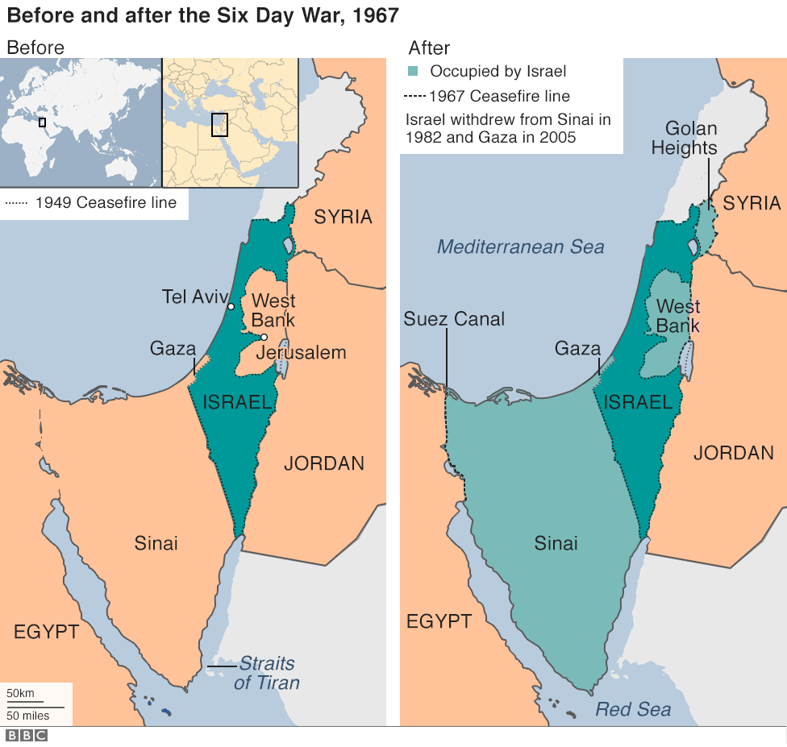
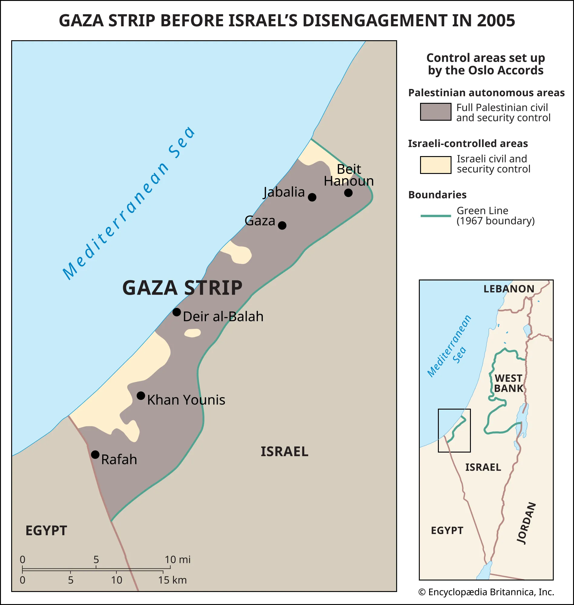
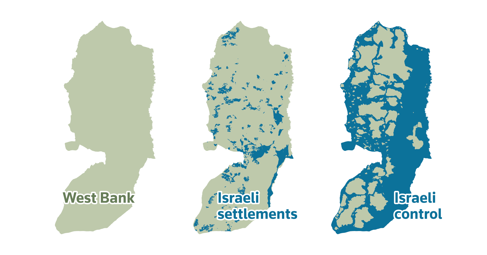

[Note for if i come back to this, look into actual lobby groups. FARA. How it all works. U.S. Chamber of Commerce. NRA. Others. Dont just talk about AIPAC. Talk about actual Israel lobby, registered under FARA. then other countries]

So I was writing this as a "side note" in the article of "Naked Econ Summary Part 3", specifically after Chapter 8, but it got way too long, and so I put this in a separate article.

I also want to say that there is so much to this topic, and I reread it, and am not satisfied with the conclusion. But there's many layers to it, and I don't have the time to fully look into it at the moment. As always, my writings are meant to be taken with a grain of salt.

## A Personal Side Note

For me, any conversation about political influence has to include AIPAC (the American Israel Public Affairs Committee), the Israeli lobby. I don't know much about politics, but we always hear about how strong the Israeli lobby is in the US. I want to learn more about why that is, and this section is my (extremely shallow) attempt to better understand it.

I mean, in November 2024, the [United Nations held a vote amongst member states asking if Palestinian people have the right to self-determination](https://www.un.org/unispal/document/the-right-of-the-palestinian-people-to-self-determination-08nov24/). Israel, the US, Paraguay and Argentina were basically the only countries that voted against it. So something is clearly wrong with these countries, and we'll just take a look at the US in this case.

### Some history

I enjoy history, and I do not claim to know the full story with all its intricate details. But here are a few things I find interesting.

Israel was declared a country on May 14, 1948. President Truman officially recognized Israel just 11 minutes after its declaration of independence, making the US the first country to do so. (For context, the Soviet Union recognized Israel three days later).

In 1948, immediately after Israel’s founding, neighboring Arab nations, including Egypt, Jordan, Syria, Iraq, and Lebanon, declared war on Israel. This was the first Arab-Israeli war, during which Israel managed to not only survive but expand its territory beyond the initial borders set by the United Nations Partition Plan of 1947.


Fast forward to 1955: Egypt, under President Gamal Nasser, began purchasing weapons from the Soviet Union, effectively aligning itself with the USSR during the Cold War. This move set the stage for the Suez Crisis, a.k.a. the second Arab-Israeli war in 1956. That year, Nasser nationalized the Suez Canal, meaning he took it out of private (mostly British and French) control and placed it under Egypt’s government. This led to a conflict involving Israel, Britain, and France against Egypt. Which just in and of itself was an interesting period, because it was a clear indicator of the decline of British and French influence in the world stage (Egypt came out victorious).

The three attacking countries had clear motives for their actions. France and Britain were furious about losing control of the Suez Canal, which they saw as crucial to their economic interests and global power. France had additional reasons to oppose Nasser, as Egypt was actively supporting independence fighters in Algeria, then still a French colony. Israel, meanwhile, was increasingly worried about Egypt's military buildup and its blockade of Israeli shipping through the Straits of Tiran. The three nations planned their attack in secret, with Israel launching the initial invasion while Britain and France joined later under the pretense of separating the warring parties.

The US position was particularly interesting, as they actively opposed their traditional allies. President Eisenhower saw the attack as dangerous old-style colonialism that risked pushing Arab states toward the Soviet Union. The US was also deeply concerned about Soviet threats to intervene on Egypt's behalf, which could have escalated into a much larger conflict. America went as far as threatening economic sanctions against Britain to force a withdrawal, demonstrating how dramatically global power dynamics had shifted since World War II.

During this period, Israel began to be seen as a pro-Western ally, while Egypt and other Arab nations increasingly aligned with the Soviet Union. Israel’s relationship with the US started to solidify, especially as tensions in the region grew.

By 1962, under President John F. Kennedy, the US agreed to sell weapons to Israel for the first time. This marked the beginning of a close military partnership.

Then came the Six-Day War of 1967, a.k.a. the third Arab-Israeli War.

The Six-Day War became a major turning point. Israel launched a preemptive strike [(Note on what led to this)](#1) against Egypt, Jordan, and Syria, capturing significant territories: the Sinai Peninsula and Gaza Strip from Egypt, the West Bank and East Jerusalem from Jordan, and the Golan Heights (which is a very important strategic plateau) from Syria.



This victory demonstrated Israel’s military capabilities and intelligence-gathering expertise, which the US saw as strategically valuable during the Cold War. Israel became a key ally in the region, providing the US with reconnaissance and intelligence while countering Soviet influence.

And what does Israel get in return? Lots of money. From 1946 to 2023, Israel has received an estimated $260 billion in aid from the US. Initially, this included both economic and military aid, but since 2008, the aid has been exclusively military. Israel currently receives $3.8 billion annually as part of a 10-year agreement signed by President Obama in 2016.

The thing about the money provided is that Israel must spend most of it in the US. Buying their missile defense systems, their fighter jets, etc. This means the funds flow back into the US economy, benefiting American defense contractors and maintaining US jobs.

Another thing to note is that the US has this thing called the Leahy Law, which says that US military hardware can only be used for defensive purposes, and can't be used in violation of human rights standards. However, these restrictions have never been enforced with Israel, giving them what some describe as a blank check for military operations. Israel is often considered an exception.

Anyway, in short, after the Six-Day War, there was the Yom Kippur War of 1973 (a.k.a. the fourth Arab–Israeli War) initiated by Syria and Egypt, both trying to recapture what they had lost in 1967, but with no success. By the way, Hafez al-Assad, father of Bashar al-Assad, made it his top priority to return the Golan Heights as he was appointed as president in 1971 (until his death in 2000).

It should also be noted that it was during this war that had begun the 1973 oil embargo, better known as the 1973 oil crisis. The Organization of Arab Petroleum Exporting Countries (OAPEC) announced that it was implementing a total oil embargo against countries that had supported Israel at any point during the 1973 Yom Kippur War (which included the USA, Canada, Japan, the UK).

The next major event was the 1978 Camp David Accords, where a peace deal was started between Egypt and Israel. And in 1979, there was the Egypt-Israel Peace Treaty, which formalized the return of the Sinai Peninsula to Egypt in exchange for peace and recognition. Egypt was thus the first Arab country to recognize Israel as a country. The full withdrawal of Israeli troops from the peninsula was in 1982.

The Golan Heights on the other hand, Israel "annexed" it in 1981, although only the USA recognizes it as Israeli territory (with the official recognition done by Donald Trump in 2019), and everyone else calls it an illegal occupation of Syrian land.

As for Gaza, Israel withdrew its military forces and dismantled its 21 Jewish settlements by 2005. Here is where Israel had control.



### Some minor details

While on this topic, I would like to note one thing that I've never heard each side talk about.

#### Palestinians

Let’s start with the Palestinians. I first learned about this in the context of the Lebanese Civil War (1975-1990). There were many factors at play, and I am not a historian, but it seems to me that Lebanon already had a fragile social and political order before the arrival of the palestinians and the PLO (Palestinian Liberation Organization). But it was especially when the PLO moved its headquarters to Lebanon in 1970 that tensions escalated (I will soon talk about where they moved from).

Lebanon was divided into many different religious groups, including Christians, Sunni Muslims, Shia Muslims, and Druze. Its political system was based on a delicate balance among these groups, determined by demographics. The last official census, conducted in 1932, showed that Christians were 51% of the population. This census heavily influenced how government positions were distributed. However, the influx of hundreds of thousands of Palestinian refugees disrupted this delicate balance.

That said, it would be unfair to blame the Palestinians alone for the civil war. There were numerous variables at play, including interference from larger regional and global powers. Countries like Egypt, Syria, Iran, the United States, Saudi Arabia, and the Soviet Union had a hand in supporting different factions within Lebanon. The influx of Palestinian refugees, along with the presence of armed PLO militants, became one of the many pressures pushing the fragile system toward collapse.

This topic led me to broader questions, like: “Why doesn’t Egypt take in Palestinian refugees?” There are numerous reasons.

One key factor is that Hamas, the governing authority in Gaza, is ideologically aligned with the Muslim Brotherhood. The Muslim Brotherhood is an Islamist organization founded in Egypt in 1928 that advocates for governance based on Islamic principles and opposes secular political systems. They gained significant political power in Egypt after the Arab Spring, briefly ruling the country from 2012 to 2013. However, the Egyptian military overthrew them in a coup and installed President Abdel Fattah el-Sisi (who is president there to this day).

El-Sisi supports a secular government model and views the Brotherhood as a major threat to Egypt's stability. Allowing an influx of Palestinians with potential ties or sympathies toward Hamas could risk introducing another destabilizing element to Egypt’s political landscape.

Then I stumbled upon a video showing the challenges Palestinian refugees have posed to previous host countries.

After the Six-Day War in 1967, many Palestinians fled to neighboring Jordan. The PLO, operating in Jordan, openly opposed the Jordanian monarchy. PLO militants had their own army and even attempted to assassinate King Hussein of Jordan [(Note 2)](#2). They also carried out robberies in Amman, targeting families and businesses in the name of collecting "financial assistance" in the ongoing war of attrition against Israel. When the Jordanian police and army tried to protect its citizens from these attacks, they'd get attacked and killed. By 1970, the situation escalated into a civil war, known as Black September, which ended with the expulsion of the PLO from Jordan. On their way out, in 1971, the prime minister of Jordan was assassinated by the Palestinian militant organization known as Black September Organization (BSO). The PLO then moved into southern Lebanon, contributing to the instability there.

In 1991, after the First Gulf War, Kuwait expelled 300'000 Palestinians, which made up 18% of its population. The reason? The PLO supported the enemy, Saddam Hussein, during Iraq’s invasion of Kuwait. And why did the PLO support the attacker of a country which brought them in when they were displaced? Several reasons, but before we get into them, we have to understand the political landscape at the time and the deep-rooted frustrations of the Palestinian people.

This story goes back to the 1930s when American oil companies first struck massive oil reserves in Saudi Arabia. Standard Oil of California, which later became Chevron, formed Aramco (the Arabian-American Oil Company) and started pumping billions of barrels of oil out of the region. The relationship became formal when President Roosevelt met Saudi Arabia’s King Abdulaziz in 1945, cementing a long-term alliance between the two countries based largely on oil and mutual security.

Kuwait came into the picture later. It was under British control until 1961, but American oil companies had already gotten a piece of the pie by the 1950s. Gulf Oil and BP were running operations in Kuwait’s oil fields, making the tiny country a strategic partner for the US. By 1990, Kuwait and Saudi Arabia together controlled a huge portion of the world’s oil supply, and the US had serious reasons to protect them from any threat.

When Saddam invaded Kuwait in 1990, the US stepped in for several reasons. First was oil security. If Saddam controlled Kuwait, he would have had enormous influence over global oil prices. Next was regional stability. Letting Iraq get away with annexing Kuwait would have set a dangerous example and made Saudi Arabia a likely next target. There were also defense commitments. The US had promised to protect Kuwait and Saudi Arabia as part of its Gulf security strategy. And then there was credibility. If America didn’t act, its reputation as a reliable security partner would have taken a major hit, possibly driving Gulf states to seek alliances with other powers like the Soviet Union.

Now let me explain why the Palestinians sided with Saddam.

First was their deep frustration with the US-backed status quo in the region. Many Palestinians saw America's strong support for Israel as blocking their aspirations for statehood. When Saddam challenged US power in the region, many Palestinians viewed him as standing up to a system they felt was unfair to them.

Second, Saddam Hussein had positioned himself as a champion of the Palestinian cause. He explicitly linked his invasion of Kuwait to the Palestinian issue, saying he would withdraw from Kuwait if Israel withdrew from occupied territories. He also launched Scud missiles at Israel during the war, which, while militarily ineffective, was symbolically powerful for many Palestinians who felt powerless against Israel. I also heard that he did so in order to get Israel to attack right back, thus getting muslim-majority countries to side with Iraq. (Israel smartly did not respond to these attacks).

Third, Saddam had provided significant financial support to Palestinian families, particularly families of those killed in conflicts with Israel. This direct aid created goodwill among many Palestinians.

Unfortunately for the Palestinians, the US came in and completely obliterated Saddam Hussein; once the ground assault began (i.e. troops came in by foot and tanks), Operation Desert Storm lasted 100 hours (I'm trying to say that it was an easy war for the US, and they got to show off their strength). The PLO's gamble did not pay off, and so they were expelled from Kuwait once the war ended.

Now of course, someone might argue, *“If Israel had never been created, none of this would have happened. Lebanon would still be the ‘Paris of the Middle East’, as it was in the 1960s, and Arab nations would be more united”*. I can see that perspective. I also get where the Palestinians were coming from. The PLO felt abandoned by Arab governments that weren’t giving them the support they expected, so they believed they had to force change.

Unfortunately, now that the dust has settled, it does look like a classic case of "biting the hand that feeds you", and so now Egypt has even built a wall to separate itself from Gaza, unwilling to open its borders because it knows taking in more Palestinians would only invite trouble.

And like many things involving humans, this is a complex system with countless variables, some big and some small. Israel and the US are big ones. Arab countries siding with them are big ones too, though they had to make tough choices (complex systems in and of themselves). They had to pick a side, and something tells me it's not exactly fun being an enemy of the US. Then there's the fact that Hamas leaders live in luxury in Doha, reportedly worth billions, while ordinary Palestinians continue to suffer.

Finally and most importantly, advocating for Palestinian statehood is not antisemitic, but wanting Jews to die is.

#### Israel

On to Israel. In the battle of who is the lesser evil, I think Israel isn't looking too good. We could ask ourselves "Well what if Gaza never armed themselves, didn't resist, etc. Wouldn't they be prosperous right now?"

We don't need to speculate what would happen, because we already know exactly what would happen. The precedent is the West Bank. 

After the 1990s and the Oslo Accords, Palestinians in the West Bank largely gave up armed resistance and accepted security coordination, yet instead of sovereignty they ended up under a system widely described as apartheid. Israeli settlements, civilian towns built by Israelis inside occupied Palestinian land, expanded steadily, carving the territory into isolated fragments. Disconnected enclaves. And instead of driving calmly from point A to point B, Palestinians must not only drive around the illegal settlements, but also face checkpoints on their own soil. All the inconvenience is placed on the Palestinians. 



I think this is [a nice article](https://www.reuters.com/graphics/ISRAEL-PALESTINIANS/STATE-WESTBANK/gkvlaejbwpb/) that talks about the situation.

Israel is the powerful side here, make no mistake about it. If someone can end the war, it's them (backed by the US of course). Palestinians cannot do anything, they are helpless, at the mercy of anyone who will help them fight (although their leaders have an important role to play too). It's Israel who has to somehow step up and propose a solution. But instead, they are doing things to aggravate the situation further. Israel's actions are what stand between Palestinians and peace. In my opinion of course.

### Is Lobbying Just Legalized Bribery?

That was a crazy tangent, but back to AIPAC.

There is a quote I've come across before: “Lobbying is basically legalized bribery”. And yeah, in practice, that is how things work.

Lobbying itself is not inherently bad. At its core, lobbying is a way for people, organizations, or industries to advocate for policies they care about. It is a legitimate part of democracy that allows citizens and interest groups to communicate their needs to lawmakers. Think about environmental groups pushing for clean energy policies, public health organizations lobbying for more funding, or nonprofits advocating for marginalized communities. These are all examples of lobbying in its ideal form, where it is simply about informing and persuading.

The problem arises when money enters the picture. When you see corporations or powerful groups spending millions of dollars to influence politicians, the entire landscape changes; those with the deepest pockets now have the loudest voices. Politicians rely heavily on campaign contributions to get elected, and donors often expect some kind of return on their investment. And this is where the line between lobbying and bribery begins to blur.

For example, a large corporation might lobby for favorable tax policies, and in return, it funds a politician’s campaign. While nothing illegal is technically happening, the exchange creates this environment where politicians prioritize the interests of big donors over the public good. And these well-funded lobbying groups can afford to hire skilled professionals, set up meetings and events to sway politicians. Meanwhile, smaller groups or average citizens often do not have the resources to compete.

## Tangent about FARA

Now to speak specifically about AIPAC. It was founded in 1951, a few years after the creation of Israel. It was called the "American Zionist Committee for Public Affairs" back then, and was renamed AIPAC ("American Israel Public Affairs Committee") in 1959, during the presidency of Dwight D. Eisenhower.

The following president, John F. Kennedy, was insisting that AIPAC registers under the Foreign Agents Registration Act, a.k.a. FARA. FARA was enacted in 1938 when there were concerns of Nazi propaganda before WW2. It's aim wasn't (and to this day, isn't) to prohibit foreign political influence, but just to expose it by requiring public disclosure. The registrants file detailed financial statements, including income and expenditures, activities, etc. And any organization acting at the direction, control, request, or funding of a foreign government or foreign political entity must absolutely register under FARA.

So the question is not "Do you support a foreign country?", but rather "Are you acting on behalf of that foreign country?", and this distinction is one of the things that AIPAC uses to its advantage.

Another important thing to note is that the US system assumes the following:

```domestic donors = domestic interests```

And AIPAC argues that:

- It is funded by US citizens and US based donors, not by the Israeli government
- Its leadership is American, not appointed by Israel
- It makes independent policy decisions rather than taking instructions from Israeli officials
- It advocates for what it defines as American interests aligned with Israel, not Israeli interests per se

Sympathy and agreement with another country is not enough to make AIPAC illegal. The DOJ would have to prove things like written instructions from the Israeli government, financial transfers from Israeli state bodies, formal coordination agreements, and evidence that messaging is dictated by Israeli officials.

AIPAC frames their policy positions as US security interests. Israeli officials are invited to speak at events, but they do not sit on governing boards. Funding flows through American nonprofit sources. And most importantly, AIPAC is simply a US organization expressing the political views of American citizens. They just happen to be Jewish or Evangelical Christians, but these are minor details.

And so what are the things that the US public doesn't know about AIPAC since they're not registered under FARA?

*“AIPAC gave $10'000 to Congressman X”*. This is not one of those thing. This is public information and not related to FARA. The flow of money is transparent thanks to campaign finance laws. 

What is not transparent are questions like: *“Are you advancing another government’s priorities?” “Are you coordinating with a foreign state?” “Are policy priorities suggested by Israeli officials?” “Is lobbying timed to match foreign diplomatic goals?”* and *“Are donor networks mobilized in response to concerns raised by a foreign government?”*

Today, AIPAC operates by focusing on relationship-building and lobbying efforts. It organizes conferences, meetings, and trips to Israel for US politicians to showcase Israel’s strategic importance. These trips are often all-expenses-paid and are designed to leave a positive impression on lawmakers.

Politicians who align with AIPAC’s agenda can expect significant financial backing. For example, in 2022, AIPAC spent $30m, and these funds were used to support candidates who shared AIPAC’s views on maintaining strong US-Israel ties. In the 2023–2024 cycle [(explanation about what a cycle is)(#3), pro-Israel PACs and affiliates spent over $37 million supporting 356 House members and 40 senators In 2024 it was $53 million in direct contributions. . And if you were a candidate who oppose Israel, [you can rest assured that your opposition will be well-funded](https://aipacorg.app.box.com/s/z2oa78jwjmr2ytmon22xumvxk2d4uphf). The politicians know this, so there's definitely that fear looming. Deviation from the [XYZ] is punished.

"Disciplining effect"

[Can add smthn else?]

Additionally, AIPAC educates its members (of which there are tens of thousands of) on how to engage with their local representatives. They help coordinate letters, calls, and visits to push specific policies. The organization also provides talking points and policy briefs that members can share with lawmakers, making it easy for politicians to align with their positions.

For comparison on the numbers, the largest lobbying group in the US, the U.S. Chamber of Commerce (USCC) (I know, sounds like it's a government entity) has spent around $40m in 2022. It mostly represents the interests of a handful of so-called "legacy industries": industries like tobacco, banking and fossil fuels which have been around for generations and learned how to leverage their earnings into political influence.

Another big one is the NRA (National Rifle Association), which has spent approximately $11m during the same period.

But unlike the NRA, which supports mostly Republicans, AIPAC has a bipartisan approach. It supports candidates from both Republican and Democratic parties, as long as they align with its pro-Israel stance. In this manner, no matter which party is in power, AIPAC’s agenda remains a priority.

Now what about foreign influences?

[January 20, 2025 Update] I must say, I am watching [President Trump's inauguration speech](https://www.youtube.com/watch?v=eS-JeYb2ED0&t=1235s) right now, and the only time that Biden/Kamala/former presidents, not only clap (okay they also clapped when he said he wants to go to Mars, otherwise Trump was just indirectly roasting them), but stand up and clap, is after Trump says this:
"The hostages in the Middle East are coming back home to their families". Obviously, he's talking only about the Israeli hostages. This is the only thing they all agree on. Isn't that a coincidence? Like, Kamala must've thought "Oh shoot, better get up and clap or else I'll be losing free money". Every time Kamala clapped her hands together, she probably made like $10k. 

### Christian Zionism

I came across [this video of Noam Chomsky](https://www.youtube.com/watch?v=lUQ_0MubbcM) talking a bit about Christian Zionism. Christian Zionism is the belief that the return of Jews to their historic homeland fulfills biblical prophecy. This belief isn’t shared by all Christians, but it’s particularly strong among Evangelical Christians in the United States. 

These Christians tend to read the Bible literally, so when it says the land of Israel belongs to the Jews, they take it at face value [(Note on specific section of the Bible)](#4). They believe that the Jewish return to Israel a is prerequisite for the Second Coming of Christ. [(Note on Zionism vs. Christian Zionism)](#5)

Anyway, in the US, there are about 70-80 million Evangelical Christians (its very hard to say, take these numbers with a grain of salt, but in 2012 The Economist estimated that "over one-third of Americans, more than 100 million", can be considered evangelical), and a significant number of them believe that supporting Israel aligns with biblical prophecy. The point is that there are a lot of them, and a lot of them are also politicians (from names we know, there's Ted Cruz, Marco Rubio, Ron DeSantis, George W. Bush, Mike Pompeo, Mike Pence. Very popular within the Republican Party as we can see, but I have not done extensive research). [(Note on other types of Christians)](#6)

If we go back in time, Woodrow Wilson, the US President during WW1, was a devout Christian who read the Bible daily. Harry Truman, the president who officially recognized Israel in 1948, 11 minutes after it was declared, shared similar religious convictions. Truman even [likened himself to Cyrus](https://scholarsarchive.byu.edu/byusq/vol34/iss1/2/#:~:text=The%20US%20was%20the%20first,as%20recorded%20in%20Ezra%201.), a Persian king in the Bible who allowed the Jews to return to their homeland after captivity.

Even during Franklin D. Roosevelt's administration (the president during WW2), Harold Ickes, a senior official, described the return of Jews to Palestine as one of the greatest historical events, rooted in fulfilling biblical prophecy.

When it comes to the British elites in the early 20th century, many were deeply Christian (although not necessarily Evangelicals). Their beliefs were shaped by a mix of Christian tradition and a sense of cultural superiority tied to their empire. They probably thought that they were fulfilling biblical prophecy by helping the Jews return to their "promised land". This mindset (I don't know what else was in it for him) influenced Arthur Balfour, the British Foreign Secretary who, in 1917, issued the Balfour Declaration. This was a letter expressing the British government’s support for creating a national home for the Jewish people in Palestine.

The letter was addressed to Lord Walter Rothschild, a member of the famous Rothschild family, which was one of the wealthiest families in the world at the time [(Note on the Rothschild family)](#7). They were bankers with ties to many Jewish causes, and although Walter Rothschild wasn’t a Zionist leader himself, he became the intermediary between British officials and the Zionist movement, led by figures like Chaim Weizmann, David Ben-Gurion, and the father of Zionism, Theodor Herzl.

So, all this just to give another angle of this deeply-rooted support that the US has towards Israel.

### Notes

#### 1

In May 1967, Egypt, led by President Gamal Abdel Nasser, moved large numbers of troops into the Sinai Peninsula, close to Israel's border.

Nasser has also ordered the United Nations Emergency Force (UNEF), which had been stationed in Sinai since the Suez Crisis of 1956 to maintain peace, to withdraw.

And finally, Egypt blocked Israeli shipping through the Straits of Tiran, a critical shipping channel for Israel's trade route to Asia and oil supply.

All this amid public threats made by Nasser and other Arab leaders to destroy Israel.

So in response, in June 1967, Israel launched a surprise air assault that decimated Egypt’s air force on the ground. This gave Israel air superiority and set the stage for rapid territorial gains in what became a six-day conflict.

[Return](#some-history)

#### 2

It's actually pretty crazy. King Hussein's grandfather, King Abdullah I, was assassinated (by a Palestinian in Jerusalem, linked to the Muslim Brotherhood) back when he was the king of Jordan in 1951, and at the time Prince Hussein (the grandson of King Abdullah I and later to become the king), 15 years old, was also shot but he survived thanks to a medal on his uniform deflecting the shot. This was the first of several assassination attempts he would survive during his 47-year reign, the longest in Jordan’s history, spanning more than half of the country’s existence since its establishment in 1921.

And apparently for many years, King Hussein was on the CIA payroll? You can google if interested.

Actually I'm rereading this later, and I was curious so decided to look into it myself. So here's what happened (and this information was declassified decades after they happened, so these are facts):

From the late 1950s through the early 1970s, King Hussein of Jordan received regular payments from the CIA. Multiple historians and journalists estimate the payments at roughly $500'000–$1'000'000 per year (in 1960s dollars). This was not a personal salary in the modern sense. The money was used to secure loyalty of the Jordanian elites by maintaining Jordan’s pro Western alignment (fund internal security, prevent coups, deter Soviet inlfluence, etc.). King Hussein basically quietly coordinated with Israel while publicly maintaining Arab legitimacy.

[Return](#palestinians)

#### 3

In the US, a cycle is a two-year period in between elections. They have the Congress, which is composed 100 Senators and 435 House members. So 535 people in total. Each state is represented with exactly 2 senators. There are 50 states, therefore there are 100 senators. Each senator serves 6-year terms, and every two years, one-third of the Senate is up for election, i.e. 33 senators. The House of Representatives however is population-based. California has 52 seats, Texas has 38, and the smallest states have 1. The larger the state's population, the more the representatives.

#### 4

This idea is rooted in specific passages in the Old Testament, such as Genesis 17:8, where God promises Abraham and his descendants the land of Canaan as an "everlasting possession".

[Return](#christian-zionism)

#### 5 

While both movements support the existence of Israel, they do so for different reasons. Jewish Zionism is about the Jewish people, about their survival and their right for self-determination, while Christian Zionism is about fulfilling what some Christians interpret as God's plan.

One is rooted in Jewish history, culture, and religion, as well as a response to centuries of antisemitism and persecution, especially in Europe. The other is rooted in a specific interpretation of the Bible, particularly the Old Testament.

[Return](#christian-zionism)

#### 6

And what do other Christians believe? Protestants, Catholics, and Orthodox Christians usually interpret the Bible less literally. They might see these promises as symbolic or tied to ancient history rather than something that applies today. Their focus tends to be on spiritual teachings and broader lessons, not specific prophecies about land or nations.

[Return](#christian-zionism)

#### 7

The Rothschild family played a significant role in supporting the establishment of Israel, both through their financial resources and their political influence.

It all started with Mayer Amschel Rothschild (1744–1812), who was born in the ghetto ("Jew Alley", as it was called) in Frankfurt Germany. He established a banking business there (the Church has historically seen charging interest, i.e. profiting from loaning money, as sinful, so that occupation was dominated by Jews). He assigned each of his five sons to expand and establish the family’s operations in major European cities: 

- Amschel Mayer Rothschild (Frankfurt)
- Salomon Mayer Rothschild (Vienna)
- Nathan Mayer Rothschild (London)
- Carl Mayer Rothschild (Naples)
- James Mayer Rothschild (Paris)

With time, they financed governments, infrastructure projects, and wars across Europe.

James Mayer Rothschild of the Paris branch had a grandson named Edmond de Rothschild (1845-1934) who was dubbed  "The Father of the Yishuv" ("Yishuv" is the Jewish community in Palestine before Israel was established in 1948. It literally means "settlement"). Why was he called that?

Because Edmond financed early Jewish settlements in Palestine, helping them purchase land and establish agricultural villages (started in the 1880s). He provided funds for irrigation, farming equipment, and infrastructure development.

Edmond was from the French branch, while Walter (1868–1937) was from the British branch. 

[Return](#christian-zionism)