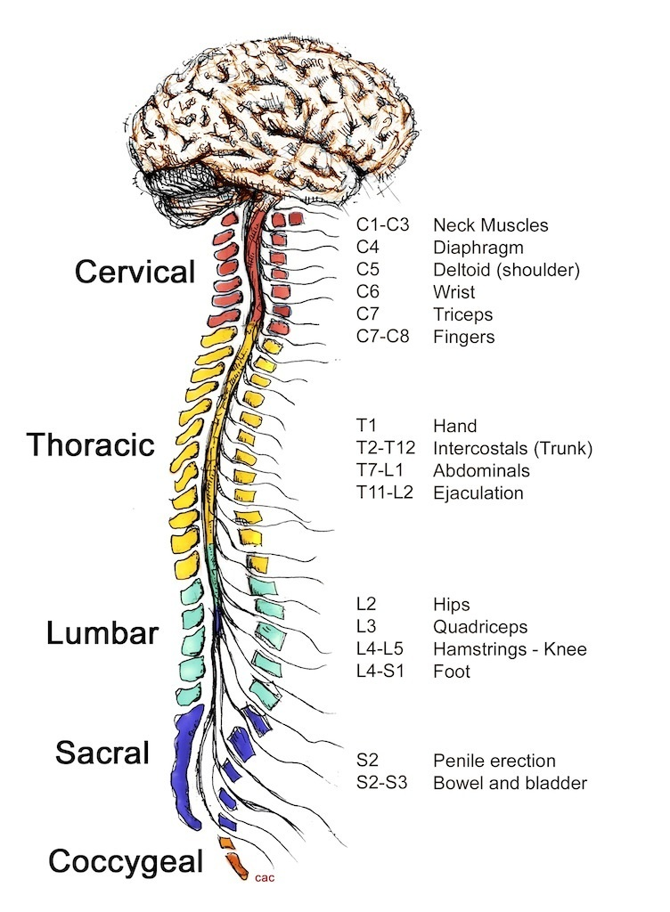

# My personal experience

Up until about a year ago, I have practiced the Wim Hof breathing Method (WHM) for fun. I am a small data sample, not enough to conclude much. However, I know that it has increased my cold-tolerance threshold; **that winter** was **the first winter** in my entire life when I actually enjoyed **winter**. The cold wasn't something I was afraid of anymore. It didn't bother me. Not only did it not bother me, but I actually felt good being in the cold. The cold was my friend. **For that reason alone, I'd argue, it is worth practicing it (coupled with cold exposure of course)**, especially considering that we live in a cold climate.

And I'm also pretty sure that the WHM has helped me fight sickness in my everyday life. Although I feel that way, I may be biased, or it may be the placebo effect. Although many other WHM practitionners have documented this, it is only anecdotal evidence. In this article, I wanted to dig into the science behind the WHM. I want to not just **feel** like it's good for me. I want to **know** that it is.

I've heard of the "ice man" a couple of years ago, but the first time I ever tried the breathing technique was in August 2021. I have compiled two mini-documentaries with clips documenting my journey with my friend Hasan. [Video 1](https://www.youtube.com/watch?v=le34bQlZ5DA) and [video 2](https://www.youtube.com/watch?v=Yvfh9lxzAro) are available to be viewed.

# Sections
 - [Prerequisite Knowledge](#prerequisite-knowledge)
   - [The nervous system](#the-nervous-system)
     - [What does the nervous system do?](#what-does-the-nervous-system-do)
     - [What are the parts of the nervous system?](#what-are-the-parts-of-the-nervous-system)
 - [Scientific Publications](#scientific-publications)
    - 

# Prerequisite Knowledge

## The nervous system

Here is an explanation from the [Cleveland Clinic website](https://my.clevelandclinic.org/health/articles/21202-nervous-system): 

### What does the nervous system do?
"Your nervous system uses specialized cells called neurons [(1)](#1) to send signals, or messages, all over your body. These electrical signals travel between your brain, skin, organs, glands and muscles.

The messages help you move your limbs and feel sensations, such as pain. Your eyes, ears, tongue, nose and the nerves all over your body take in information about your environment. Then nerves carry that data to and from your brain.

Different kinds of neurons send different signals. Motor neurons tell your muscles to move. Sensory neurons take information from your senses and send signals to your brain. Other types of neurons control the things your body does automatically, like breathing, shivering, having a regular heartbeat and digesting food."

### What are the parts of the nervous system?

Okay. Now we know that the nervous system is a complex network of specialized cells called neurons that transmit signals between different parts of the body. Great. But the nervous system can be broadly **divided into two parts**: the **central nervous system (CNS)**, which consists of the brain and spinal cord, and the **peripheral nervous system (PNS)**, which includes all the nerves that extend/branch out from the CNS to the rest of the body. This system relays (transmits) information between your brain and spinal cord , and your organs, arms, legs, fingers and toes. 

The **PNS can be further divided** into two parts: the **somatic nervous system**, which controls voluntary movements and sensory information, and the **autonomic nervous system (ANS)**, which regulates the involuntary functions of the body, such as heart rate, digestion, and respiration (activities you do without thinking about them). The **ANS is further divided** into two branches: the **sympathetic nervous system (SNS)** and the **parasympathetic nervous system (PNS)**.

The SNS is responsible for the body's "fight or flight" response to stress and danger, while the PNS is responsible for the body's "rest and digest" response to relaxation and safety.

The SNS prepares the body for quick action in response to a perceived threat, such as increasing heart rate and blood pressure, dilating the pupils, and increasing respiration. The PNS, on the other hand, promotes relaxation and conserves energy, such as slowing the heart rate and decreasing respiration.

These two systems work in tandem to maintain balance in the body, regulating various bodily functions and responding to changes in the environment.

The SNS is responsible for the "fight or flight" response in the body, which prepares the body to respond to stressors by increasing heart rate, respiration, and blood pressure, and diverting blood flow away from non-essential organs towards the muscles and brain. The SNS is activated by the release of the hormone epinephrine (also known as adrenaline) from the adrenal glands.

## What about the nervous system?

# Scientific Publications

[Voluntary activation of the sympathetic nervous system and attenuation of the innate immune response in humans](https://www.ncbi.nlm.nih.gov/pmc/articles/PMC4034215/) Kox, M., et al. (2014).

## Summary: 
This study examined the effects of the Wim Hof Method on the autonomic nervous system and immune response. The results showed that participants who practiced the method were able to voluntarily activate their sympathetic nervous system and suppress their innate immune response.

## Some more details:
Prior to this study, no one thought that a person could voluntarily affect their sympathetic nervous system and their immune system.

So now we have two different systems we must understand before we can move on:

1. 

2. 

https://www.instagram.com/susanna_soeberg/

## Notes:
#### 1. 
I somehow never internalized the fact that neurons aren't just in the brain. As it also turns out, the spinal cord serves as a communication pathway between the brain and the rest of the body. The spinal cord carries both sensory information (from the body to the brain) and motor commands (from the brain to the body). 
For instance, when you touch a hot surface, sensory neurons in your skin send a signal through the spinal cord to your brain, which then processes the information and sends a response signal back through the spinal cord to move your hand away from the heat.  

Also look at this!

There is a small hole in the skull through which the spinal cord passes through to physically connect to the brain! This hole (fyi) is called the foramen magnum.