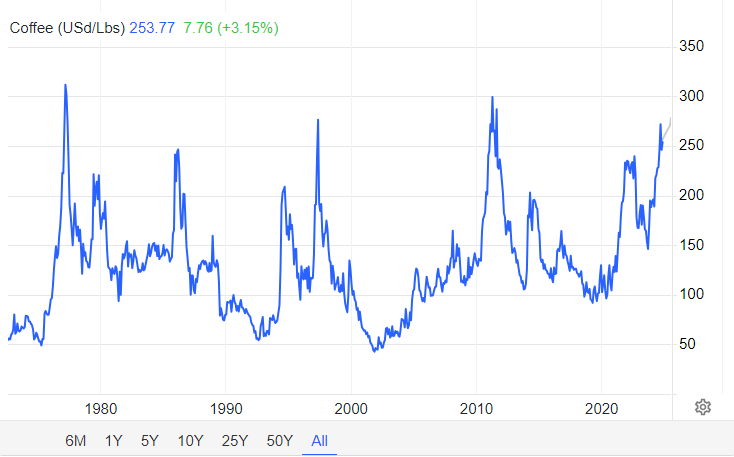
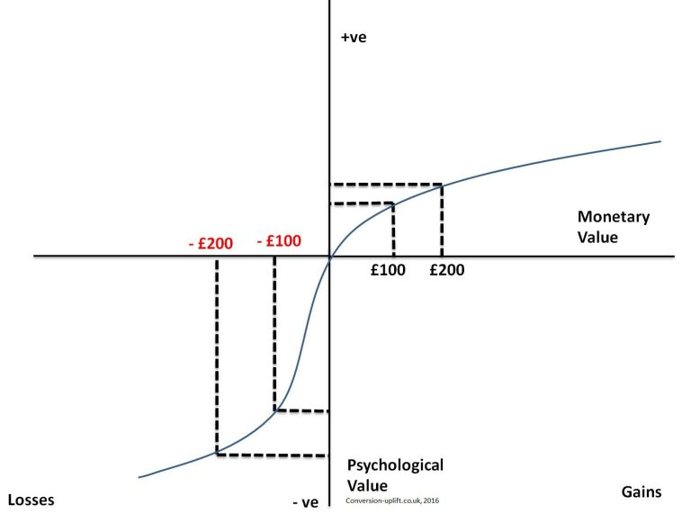
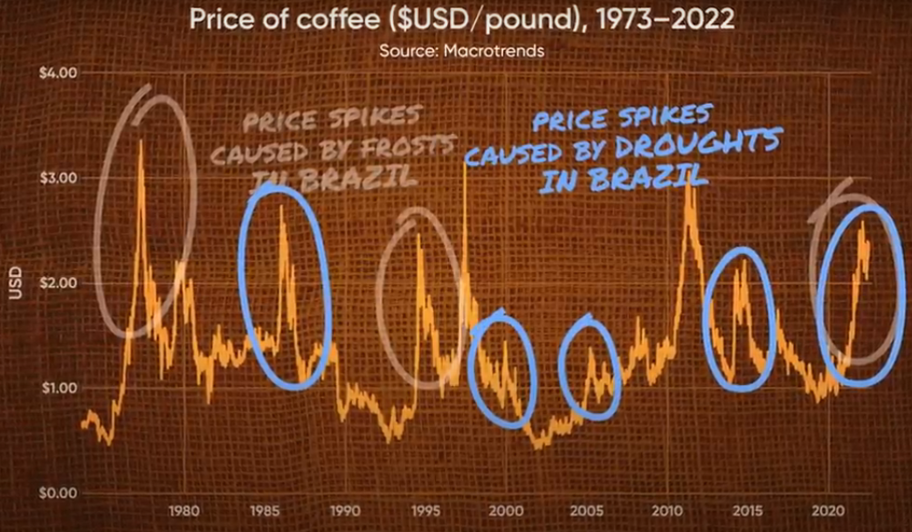

This is Part 2 of my summary of "Naked Economics: Undressing the Dismal Science". It only covers Chapter 7: Financial Markets, starting with a summary of the chapter, and then I dive into topics of interest to me.

## Chapter 7: Financial Markets

Financial products and instruments can get complicated. We have stocks and bonds, but we also have options, futures, commodities, and credit default swaps. Actually, things got so complicated and opaque that even the professionals didn’t fully understand the products they were buying and selling, which is exactly how we ended up with 2008. No matter the complexity in finance, no matter all the jargon and frantic activity that happens on Wall Street, everything that happens in a financial market always boils down to these four fundamental needs:

**1. Raising capital:** Individuals (through a credit card, or a bank loan), companies (through debt financing by issuing bonds or through equity financing by selling stocks), and governments (through treasury bonds or municipal bonds) need capital to do things today that they could not otherwise afford.

**2. Storing, protecting, and making profitable use of excess capital:**  If you hold cash, it will get eaten away by inflation. And the world is full of prospective borrowers, all of whom are willing to pay for the privilege of accessing your cash. 

> There is a reason that "interest" in math formulas are not denoted with an "*i*", but with an "*r*": the "rental rate" on capital. Individuals/companies are renting out their cash to others who can make more productive use of it. 

**3. Insuring Against Risk:** Risk aversion is one of humans' most fundamental characteristics [(Note 1)](#1). We hate to lose. So we don't mind paying a bit every month to feel safe. 

We are all familiar with health, life and car insurance. They work by charging everyone a bit more than they expect to pay out, averaged over everyone. So they make a profit, those who need the money will get it, and those who don't need it at least got a peace of mind.

> Anything can be insured. For example, a French oil tanker was rammed by a suicide bomber in 2002 off the coast of Yemen, and the insurance company ended up paying $70M.

**4. Speculation:** Financial products can also be used to bet on short-term price movements. You can bet that the price of Microsoft stock next year will be higher than it is today. While on average, over a long period, prices do go up, in the short-term, things are harder to predict. That's what sports and financial products have in common: they facilitate gambling, even if that is not their primary purpose.

Let's now dive deeper into specific topics in finance.

### Starbucks and Hedging

Take a look at the price of coffee beans over the past 50+ years:

*Historical graph of coffee beans price as found on https://tradingeconomics.com/commodity/coffee.*

It’s anything but stable. Coffee prices [(Note 2)](#2) bounce all over the place, thanks to unpredictable factors like weather [(Note 3)](#3), politics, and crop diseases in coffee-growing regions. Now, the question is, **why doesn’t the price of your Pumpkin Spice Latte follow this graph?**

It is in Starbucks' best interest to avoid being hit by unpredictable jumps in global coffee prices. So, Starbucks hedges against price swings by using futures contracts. A futures contract is simply an agreement to buy a set amount of coffee beans at a specific price, months or even years in advance. By locking in prices this way, Starbucks protects itself from short-term volatility: if coffee prices soar, they still pay the lower, agreed-upon price. If prices drop, well, they miss out on a deal. And that's okay, because the goal for Starbucks is to keep prices predictable so that a Pumpkin Spice Latte will cost around the same for longer.

And it’s a similar story on the coffee producer’s side. By using futures contracts, coffee growers can lock in a price for their beans even before harvest, giving them a stable income they can rely on. While they could wait and hope for higher prices, they face risks like fluctuating demand and potential increases in global coffee supply, both of which could push prices down unexpectedly. In this case, securing a futures contract at a stable price turns out to be a smart move. These growers are willing to trade some potential gains for the security of a reliable income. This is insurance, just like health or car insurance, providing a safety net against the ups and downs of the market.

Clearly, futures contracts fall into the "3. Insuring Against Risk" category, right? Everyone is willing to pay a little price in order to ensure stability. Airlines use futures contracts to lock in a predictable price for jet fuel. Fast-food restaurants use them for ground beef, pork, and even cheddar cheese.

### Catastrophe Bonds: A Hedge Against Nature

Catastrophe bonds, or “cat bonds,” allow insurance companies to hedge against the financial risks of natural disasters. A bond is essentially a loan from investors to the company; in exchange, investors earn interest and eventually get their principal back. With catastrophe bonds, if a disaster strikes, the insurance company keeps the bond money to cover claims, and investors may lose some or all of their principal. But if no disaster occurs, the investors get their principal back plus interest, making it a high-risk, high-reward investment.

In the late 1990s, the United Services Automobile Association (USAA) issued over \$1.5 billion in cat bonds tied to the hurricane season on the East Coast. The terms were straightforward: if there was little or no hurricane damage during the season, investors would get their principal back plus a high annual interest rate of around 12%. If damages exceeded \$1.5 billion, they’d lose their principal entirely, while moderate damage between \$1 billion and \$1.5 billion meant a partial loss.

The primary investors in these securities are hedge funds, pension funds, and other institutional investors. The main attraction for them is the high interest rate, often much higher than regular bonds. Plus, because cat bonds are tied to specific natural events rather than the ups and downs of the economy, they offer a steady return even when financial markets aren’t doing well, giving investors a useful buffer when other investments are struggling.

### Cancellation Bonds: A Hedge Against Terrorism

Sometimes, organizations face unique risks that go beyond natural disasters, like the risk of a major event being canceled due to terrorism. For the 2006 World Cup in Germany, the World Football Federation (FIFA) decided to protect itself against the possibility of a catastrophic event leading to the tournament’s cancellation. To do this, FIFA issued $260 million in "cancellation bonds".

These bonds worked similarly to catastrophe bonds. Investors would receive interest payments, but if a terrorist attack forced the World Cup to be canceled, FIFA would keep the principal to cover its financial losses. If the event went on as planned without incident, investors would get their money back along with interest.

*"The beauty of these products lies in the way they spread risk. The party selling the bonds avoids ruin by sharing the costs of a natural disaster or a terrorist attack with a broad group of investors, each of whom has a diversified portfolio and will therefore take a relatively small hit even if something truly awful happens."* - Charles Wheelan, Ch.7

### Credit Default Swaps: A Hedge Against Default Risk

## Notes:

#### 1

In a classic experiment on risk aversion, participants choose between a guaranteed \$50 and a coin flip where they could win \$100 or get nothing. Despite both options offering the same average outcome, most people pick the guaranteed \$50, showing a preference for certainty over risk. This tendency, called risk aversion, is rooted in loss aversion, the idea that people feel losses more intensely than gains, a concept from prospect theory by psychologists Daniel Kahneman and Amos Tversky. This experiment shows how people often favor the comfort of a sure outcome over the chance of a larger reward.

*Prospect theory graph showing that losses hit harder than gains, explaining why people tend to avoid risk.*

[Return](#chapter-7-financial-markets)

#### 2

Coffee beans are a commodity. Commodities are essential building blocks in the global economy, as they are raw materials used to produce goods and services.

A commodity is a basic good or raw material that can be bought, sold, or traded. Commodities are typically standardized and interchangeable, meaning one unit of the commodity is essentially the same as another. They’re categorized mainly into:

- Hard Commodities: Natural resources mined or extracted, like gold, oil, and copper.
- Soft Commodities: Agricultural products or livestock, like soybeans, corn, [pigs](https://ca.investing.com/commodities/lean-hogs) and [cows](https://ca.investing.com/commodities/live-cattle).

[Return](#starbucks-and-hedging)

#### 3

Coffee comes in two main types: Arabica (which most people, and Starbucks, mainly get) and Robusta. Coffee plants thrive in tropical and subtropical climates, and Arabica (the more popular of the two) grows best at higher altitudes. So, the ideal spot for growing coffee? High-altitude regions around the equator. Only a handful of countries meet these conditions: Brazil (which produces around 40% of the world’s coffee), Vietnam (17%), Colombia (8%), Indonesia (7%), and Honduras (5%). Other big producers are Ethiopia, India, Uganda, Mexico, and Peru.

With such a limited number of coffee-growing regions, any disruption to their agriculture has a big impact on coffee prices worldwide. Take Brazil, for example. In [July of 1975](https://www.nytimes.com/1975/08/04/archives/frost-in-brazil-sending-coffee-prices-up-frost-in-brazil-raises.html), snow hit Brazil for the first time in decades, wiping out nearly half of its coffee trees and sending prices soaring. A similar event happened in [July of 1994](https://www.latimes.com/archives/la-xpm-1994-07-12-fi-14722-story.html), causing another spike. But it's not just frost that’s a threat; droughts and irregular rainfall can mess with coffee yields, leading to shortages and price jumps.

*Graph showing historical coffee price spikes due to frost and drought events in Brazil.*

[Return](#starbucks-and-hedging)

#### 4
