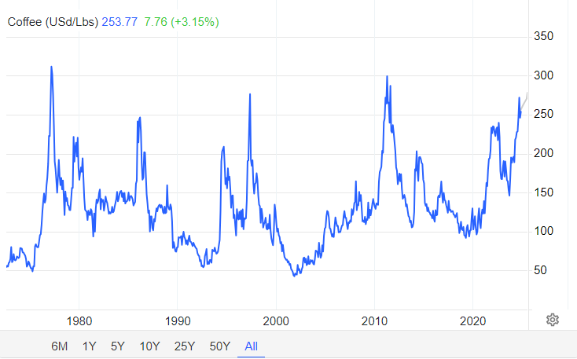
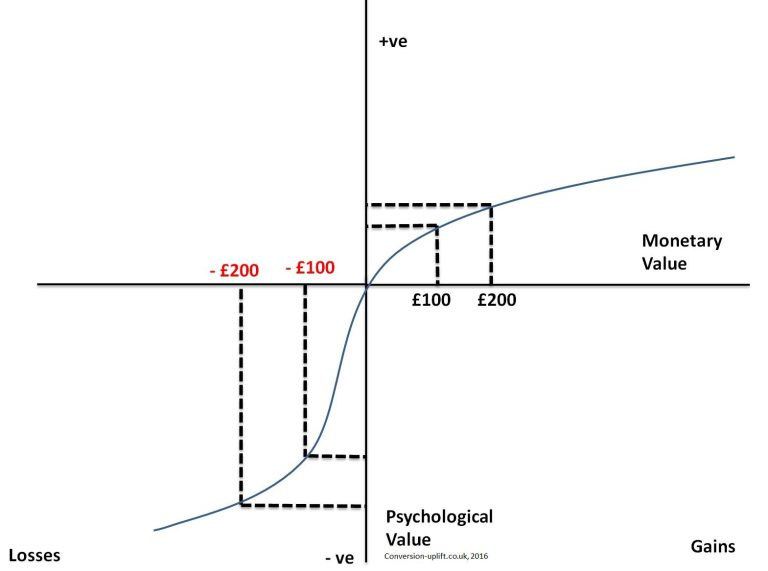

This is Part 2 of my summary of "Naked Economics: Undressing the Dismal Science". It only covers Chapter 7: Financial Markets, starting with a summary of the chapter, and then I dive into topics of interest to me.

## Chapter 7: Financial Markets

Financial products and instruments can get complicated. We have stocks and bonds, but we also have options, futures, commodities, and credit default swaps. Actually, things got so complicated and opaque that even the professionals didn’t fully understand the products they were buying and selling, which is exactly how we ended up with 2008. No matter the complexity in finance, no matter all the jargon and frantic activity that happens on Wall Street, everything that happens in a financial market always boils down to these four fundamental needs:

**1. Raising capital:** Individuals (through a credit card, or a bank loan), companies (through debt financing by issuing bonds or through equity financing by selling stocks), and governments (through treasury bonds or municipal bonds) need capital to do things today that they could not otherwise afford.

**2. Storing, protecting, and making profitable use of excess capital:**  If you hold cash, it will get eaten away by inflation. And the world is full of prospective borrowers, all of whom are willing to pay for the privilege of accessing your cash. 

> There is a reason that "interest" in math formulas are not denoted with an "*i*", but with an "*r*": the "rental rate" on capital. Individuals/companies are renting out their cash to others who can make more productive use of it. 

**3. Insuring Against Risk:** Risk aversion is one of humans' most fundamental characteristics [(Note 1)](#1). We hate to lose. So we don't mind paying a bit every month to feel safe. 

We are all familiar with health, life and car insurance. They work by charging everyone a bit more than they expect to pay out, averaged over everyone. So they make a profit, those who need the money will get it, and those who don't need it at least got a peace of mind.

> Anything can be insured. For example, a French oil tanker was rammed by a suicide bomber in 2002 off the coast of Yemen, and the insurance company ended up paying $70M.

**4. Speculation:** Financial products can also be used to bet on short-term price movements. You can bet that the price of Microsoft stock in two hours will be higher than it is right now. While on average, over a long period, prices do go up, in the short-term, things are harder to predict. That's what sports and financial products have in common: they facilitate gambling, even if that is not their primary purpose.

Let's now dive deeper into specific topics in finance.

### Starbucks and Hedging

Take a look at the price of coffee beans over the past 50+ years:

*Historical graph of coffee beans price as found on https://tradingeconomics.com/commodity/coffee.*

It’s anything but stable. Coffee prices [(Note 2)](#2) bounce all over the place, thanks to unpredictable factors like weather [(Note 3)](#3), politics, and crop diseases in coffee-growing regions. Now, the question is, **why doesn’t the price of your Pumpkin Spice Latte follow this graph?**

It is in Starbucks' best interest to avoid being hit by unpredictable jumps in global coffee prices. So, Starbucks hedges against price swings by using futures contracts. A futures contract is simply an agreement to buy a set amount of coffee beans at a specific price, months or even years in advance. By locking in prices this way, Starbucks protects itself from short-term volatility: if coffee prices soar, they still pay the lower, agreed-upon price. If prices drop, well, they miss out on a deal. And that's okay, because the goal for Starbucks is to keep prices predictable so that a Pumpkin Spice Latte will cost around the same for longer.

And it’s a similar story on the coffee producer’s side. By using futures contracts, coffee growers can lock in a price for their beans even before harvest, giving them a stable income they can rely on. While they could wait and hope for higher prices, they face risks like fluctuating demand and potential increases in global coffee supply, both of which could push prices down unexpectedly. These growers are willing to trade some potential gains for the security of a reliable income. This is insurance, just like health or car insurance, providing a safety net against the ups and downs of the market.

Clearly, futures contracts fall into the "3. Insuring Against Risk" category, right? Everyone is willing to pay a little price in order to ensure stability. Airlines use futures contracts to lock in a predictable price for jet fuel. Fast-food restaurants use them for ground beef, pork, and even cheddar cheese.

### Catastrophe Bonds: A Hedge Against Nature

Catastrophe bonds, or “cat bonds,” allow insurance companies to hedge against the financial risks of natural disasters. A bond is essentially a loan from investors to the company; in exchange, investors earn interest and eventually get their principal back. With catastrophe bonds, if a disaster strikes, the insurance company keeps the bond money to cover claims, and investors may lose some or all of their principal. But if no disaster occurs, the investors get their principal back plus interest, making it a high-risk, high-reward investment.

In the late 1990s, the United Services Automobile Association (USAA) issued over \$1.5 billion in cat bonds tied to the hurricane season on the East Coast. The terms were straightforward: if there was little or no hurricane damage during the season, investors would get their principal back plus a high annual interest rate of around 12%. If damages exceeded \$1.5 billion, they’d lose their principal entirely, while moderate damage between \$1 billion and \$1.5 billion meant a partial loss.

The primary investors in these securities are hedge funds, pension funds, and other institutional investors. The main attraction for them is the high interest rate, often much higher than regular bonds. Plus, because cat bonds are tied to specific natural events rather than the ups and downs of the economy, they offer a steady return even when financial markets aren’t doing well, giving investors a useful buffer when other investments are struggling.

### Cancellation Bonds: A Hedge Against Terrorism

Sometimes, organizations face unique risks that go beyond natural disasters, like the risk of a major event being canceled due to terrorism. For the 2006 World Cup in Germany, the World Football Federation (FIFA) decided to protect itself against the possibility of a catastrophic event leading to the tournament’s cancellation. To do this, FIFA issued $260 million in "cancellation bonds".

These bonds worked similarly to catastrophe bonds. Investors would receive interest payments, but if a terrorist attack forced the World Cup to be canceled, FIFA would keep the principal to cover its financial losses. If the event went on as planned without incident, investors would get their money back along with interest.

*"The beauty of these products lies in the way they spread risk. The party selling the bonds avoids ruin by sharing the costs of a natural disaster or a terrorist attack with a broad group of investors, each of whom has a diversified portfolio and will therefore take a relatively small hit even if something truly awful happens."* - Charles Wheelan, Ch.7

### Credit Default Swaps: A Hedge Against Default Risk

So imagine we have a borrower and a lender. The lender wants to protect themselves in case the borrower doesn’t pay back the loan. To do this, they buy a credit default swap (CDS) from a third party, known as the CDS seller. The lender pays the CDS seller a regular fee, and in exchange, the CDS seller promises to pay the lender the loan amount if the borrower defaults. This way, the CDS shifts the risk of the borrower not paying from the lender to the CDS seller, giving the lender peace of mind.

Here's a concrete example: your partner insists that you lend \$25,000 to your brother-in-law, but you’re not confident he’ll pay it back. You’re worried that the money might be lost. To protect yourself, you approach a third person who has more faith in your brother-in-law’s ability to repay. You agree to pay this person a small fee, and in return, they promise to cover the \$25,000 if your brother-in-law doesn’t pay you back. In this setup, you’re using the third party as a kind of insurance, ensuring you’re protected even if things go wrong with the loan.

The term **"Credit Default Swap"** breaks down like this: **“Credit”** refers to the loan or debt that’s being insured, **“Default”** points to the risk that the borrower might not fulfill their payment obligations, and **“Swap”** describes the agreement between two parties to exchange the risk of default. In short, a Credit Default Swap is a contract that transfers the risk (swap) of a borrower’s failure to repay (default) on a debt obligation (credit) from one party to another.

### Who Really Owns Your Mortgage?

Imagine this: I recently bought a home in the US with a mortgage. I make my monthly payments to Wells Fargo. In my mind, Wells Fargo gave me the money to purchase the home, and now I am paying them back the principal amount plus some interest.

This is actually not what happens. Here's the real story:

1. Wells Fargo did initially lend me the money, but they quickly sold my mortgage to someone else (like Fannie Mae or Freddie Mac [(Note 4)](#4)). Both of these are "government-sponsored enterprises" that buy mortgages from banks, providing liquidity so banks can keep issuing new mortgages to homebuyers. They together own or **guarantee** about half of all mortgages in the US.
2. Wells Fargo now just "services" my loan, meaning:

    - They collect my payments
    - Handle my paperwork
    - Deal with any questions I have
    - Take a small fee for this service
    - Pass the rest of my payment to the actual owner
3. The funny part is that Fannie Mae and Freddie Mac don't usually keep these mortgages either. They package thousands of mortgages together and create Mortgage Backed Securities (MBS). These MBS are then sold to investors like pension funds, insurance companies, and investment firms. Fannie and Freddie **guarantee** these MBS by promising investors they'll get paid even if homeowners default.
4. The remaining mortgages in the US follow a different path. Some stay with the banks that issued them. Others are packaged into private label MBS by Wall Street firms, similar to Fannie and Freddie's process but without any government guarantee.

In summary, my monthly payment to Wells Fargo actually takes quite a journey. They keep a small servicing fee, but most of my payment goes into a pool with payments from many other homeowners. Investors who bought shares of the MBS receive payments from this entire pool. These investors could be a pension fund in California, an insurance company in Europe, or any number of other institutional investors.

### CDS in The Real World

Let's go back to Credit Default Swaps (CDS) really quickly. I will assume you remember the brother-in-law analogy I gave. Now let's use real-world players.

Let's say we have a pension fund PF1. This pension fund has to invest the money that US citizens contribute through their paychecks. The investments aim to grow this money to pay future retirees. And because peoples' future depends on this, PF1 must ensure that its investments are very safe. PF1, for example, can only buy securities [(Note 5)](#5) that are rated A or higher. Again, this is an example. So PF1 typically buys government bonds and corporate bonds [(Note 6)](#6) rated A, AA, or AAA.

> Bond example: Let's say PF1 buys a \$100 million bond from Company C1. This is essentially PF1 lending \$100 million to C1. In return, C1 promises two things: first, they will pay PF1 3.5% interest (\$3.5 million) every year for 10 years, and second, they will return the original \$100 million at the end of the 10 years. This way, PF1 knows exactly how much money they'll receive and when they'll receive it: \$3.5 million each year, plus their \$100 million back in year 10. That is how a bond works.

Now, let's say there's a corporate bond rated BBB. While this is still "investment grade" (meaning it's considered low-risk), it's below PF1's required A-rating threshold. However, if insurance giant AIG (which had a stellar AAA rating at the time) sells PF1 a CDS on these BBB-rated bonds, something interesting happens. With AIG's guarantee through the CDS, PF1 can now effectively treat this investment as AAA-rated. After all, either the company pays its debts, or AAA-rated AIG will pay PF1 instead. So for all intents and purposes, with AIG's guarantee, that BBB-rated bond becomes as safe as an AAA-rated bond.

> Continuing from the corporate bond example, let's see what happens when AIG gets involved with a credit default swap. PF1 is earning 3.5% (\$3.5 million) per year on their \$100 million BBB-rated bond. Now, they pay AIG a 1% annual fee (\$1 million) for the CDS contract. So PF1's net return is now 2.5% (\$2.5 million) per year, but with AAA-rated protection from AIG.

And this is happening not only with corporate bonds, but also mortgages. Remember those mortgage-backed securities (MBS) I mentioned? The same principle applies there. When MBS were rated below what pension funds could buy, they would purchase CDS from AAA-rated companies like AIG to make these investments be safer.

### What Can Possibly Go Wrong?

Here's where we may get into a bit of a sticky situation. AIG wasn't just selling these CDS contracts to PF1. They were selling similar protections to many other pension funds (PF2, PF3, and so on), as well as banks and other institutions worldwide. All in all, they had written CDS contracts on about \$441 billion worth of securities. 

Let's put this in perspective: AIG was collecting roughly \$500 million in annual fees while taking on \$441 billion in potential obligations. And the thing is that they only had about $60 billion in total capital to cover potential losses. They were essentially writing insurance policies far beyond their ability to pay if things went wrong. 

But what are the chances that things go wrong, right? What are the chances that suddenly, a bunch of MBS turn bad? For that to happen, a bunch of homeowners would have to default on their mortgage. But even if that happens, the home acts as a collateral in case of a default, and since home prices always rise, it can always be sold for a profit,  right? No downside.

Unfortunately, this seemingly foolproof logic created dangerous incentives throughout the system. Banks started giving mortgages to just about anyone, even those with poor credit scores, no proof of income, or no down payment. Why? Because they weren't planning to keep these risky mortgages on their books. They would quickly bundle them into mortgage-backed securities and sell them to investors. Plus, with house prices consistently rising, banks figured that even if borrowers defaulted, they could always seize and sell the house for a profit.

These risky loans were called subprime mortgages. Many came with variable interest rates that started low but could increase significantly after a few years. When interest rates began rising in 2006, monthly payments shot up, and many homeowners couldn't keep up.

The rating agencies (Moody's, Standard & Poor's, and Fitch) claimed these mortgage bundles deserved AAA ratings because combining mortgages from different regions created "diversification." The theory was that while some homeowners might default, the chances of widespread defaults across the entire country were minimal. But there was a fundamental problem with the rating system: these agencies were paid by the very banks whose securities they were rating. If one agency gave a low rating, banks would simply take their business to a competitor. This created a situation where rating agencies had an incentive to give higher ratings to keep their business.

The house of cards finally collapsed when housing prices started falling nationwide in 2007. Suddenly, homes were worth less than their mortgages, and millions of homeowners with unaffordable payments simply walked away. The "safe" collateral that was supposed to protect against losses became nearly worthless. This triggered a cascade of defaults on mortgage-backed securities, and AIG had to pay up on many of their CDS contracts at once. With only \$60 billion in capital to cover \$441 billion in guarantees, AIG was quickly overwhelmed, forcing the government to step in with a \$185 billion bailout.

### Notes

#### 1

In a classic experiment on risk aversion, participants choose between a guaranteed \$50 and a coin flip where they could win \$100 or get nothing. Despite both options offering the same average outcome, most people pick the guaranteed \$50, showing a preference for certainty over risk. This tendency, called risk aversion, is rooted in loss aversion, the idea that people feel losses more intensely than gains, a concept from prospect theory by psychologists Daniel Kahneman and Amos Tversky. This experiment shows how people often favor the comfort of a sure outcome over the chance of a larger reward.

*Prospect theory graph showing that losses hit harder than gains, explaining why people tend to avoid risk.*

[Return](#chapter-7-financial-markets)

#### 2

Coffee beans are a commodity. Commodities are essential building blocks in the global economy, as they are raw materials used to produce goods and services.

A commodity is a basic good or raw material that can be bought, sold, or traded. Commodities are typically standardized and interchangeable, meaning one unit of the commodity is essentially the same as another. They’re categorized mainly into:

- Hard Commodities: Natural resources mined or extracted, like gold, oil, and copper.
- Soft Commodities: Agricultural products or livestock, like soybeans, corn, [pigs](https://ca.investing.com/commodities/lean-hogs) and [cows](https://ca.investing.com/commodities/live-cattle).

[Return](#starbucks-and-hedging)

#### 3

Coffee comes in two main types: Arabica (which most people, and Starbucks, mainly get) and Robusta. Coffee plants thrive in tropical and subtropical climates, and Arabica (the more popular of the two) grows best at higher altitudes. So, the ideal spot for growing coffee? High-altitude regions around the equator. Only a handful of countries meet these conditions: Brazil (which produces around 40% of the world’s coffee), Vietnam (17%), Colombia (8%), Indonesia (7%), and Honduras (5%). Other big producers are Ethiopia, India, Uganda, Mexico, and Peru.

With such a limited number of coffee-growing regions, any disruption to their agriculture has a big impact on coffee prices worldwide. Take Brazil, for example. In [July of 1975](https://www.nytimes.com/1975/08/04/archives/frost-in-brazil-sending-coffee-prices-up-frost-in-brazil-raises.html), snow hit Brazil for the first time in decades, wiping out nearly half of its coffee trees and sending prices soaring. A similar event happened in [July of 1994](https://www.latimes.com/archives/la-xpm-1994-07-12-fi-14722-story.html), causing another spike. But it's not just frost that’s a threat; droughts and irregular rainfall can mess with coffee yields, leading to shortages and price jumps.

*Graph showing historical coffee price spikes due to frost and drought events in Brazil.*

[Return](#starbucks-and-hedging)

#### 4

The Federal National Mortgage Association (FNMA) is abbreviated to Fannie Mae, and the Federal Home Loan Mortgage Corporation (FHLMC) is nicknamed Freddie Mac.

[Return](#who-really-owns-your-mortgage)

#### 5

A security is a fancy word for any investment product that can be bought and sold, like stocks or bonds.

[Return](#cds-in-the-real-world)

#### 6

Pension funds typically focus more on bonds than stocks for a fundamental reason: their predictability. Bonds provide regular, fixed interest payments and return the principal at maturity (if there's no default). While stocks might offer higher potential returns, they're also more volatile. Since pension funds need to ensure they can make regular payments to retirees well into the future, they prefer the steady, reliable nature of bonds.

[Return](#cds-in-the-real-world)
