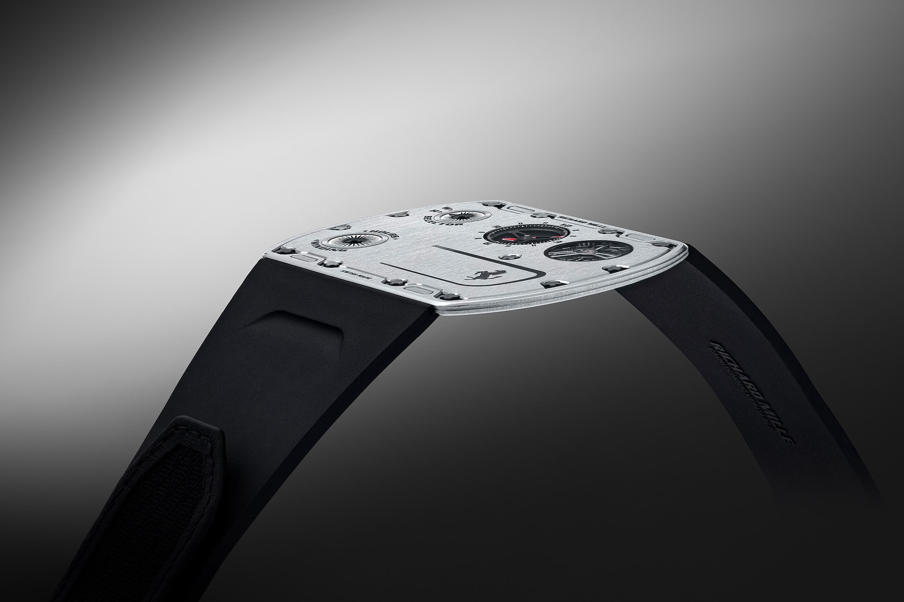

I used to not understand car enthusiasts, wine enthusiasts, sneaker collectors, or art lovers. But now I do.

Not because I now enjoy these things myself, but because I got into something that is, in my opinion, more extreme than the interests listed above. I think I picked up an edge case; I've reached a boundary of interests, and so anything within the boundary is understandable now. I didn't even know this edge case existed. I didn't know it was a thing. And I certainly didn't think that it could be a thing.

## The Most Useless Object I Own

I absolutely abhor materialism.

You know how there are the five love languages? Physical touch, quality time, acts of service, words of affirmation, and receiving gifts. Well, "gifts" ranks so low for me it shouldn't even be on the list. The thought of accumulating more possessions feels like a burden. I feel like it creates an obligation to keep, display, or use the thing. I don't want to be cluttered with objects and their underlying obligations.

Introducing: the wristwatch.

A perfect example of human irrationality. The time is everywhere around us now: phones, laptops, stoves, car displays. A mechanical timepiece on your wrist makes about as much sense as riding a horse to work (unless you're one of the few people who actually dive to the bottom of the ocean and require one).

But it gets better. People spend thousands of dollars on watches, and some wait years on a waitlist for the privilege to spend \$50,000 on one. 

The best part? They all keep worse time than a \$30 quartz watch from the mall.

But because we have already established that watches are redundant and irrational, arguing about accuracy does nothing. 

Bringing up accuracy here is like criticizing a painting because it doesn't look as realistic as a photograph.

It's like arguing that a Toyota is more reliable than a Pagani. Sure, it's true, but it completely misses the point of why people are drawn to expensive cars in the first place.

I'm not a car guy. To me, the point of a car is to get me from point A to point B. I can do that in a Corolla. I don't need a Mercedes CLS 63 AMG to do so. But for some people, a car is more than a piece of metal on wheels. It's a chamber in which they spend hours a day, getting around the city. So they want to make that time special. They want something that brings them joy every time they sit in it (even if that joy might've stemmed from clever marketing and social conditioning). They want something unique that makes them recognizable. When friends see their car in a parking lot, they know that person has arrived. The car becomes an extension of who they are. Even though you're spending more on premium fuel and getting worse mileage, the emotional aspect weighs more than the extra money spent on fuel.

So I get it.

And a watch is even more useless.

At least with an expensive car, you get tangible improvements: you can feel the acceleration push you back in your seat, the premium leather against your skin, the warmth of the heated steering wheel on cold mornings. 

With watches? Nothing like that. It's just some gears and springs placed into a case, and they all do exactly the same thing: tell time.

But again, the premise here is wrong because telling time isn't even the point anymore.

When you walk through a local artisan market, you don't expect to get the best deal on a handmade leather wallet. You don't expect it to compete in price with mass-produced wallets from Chinese factories. You understand you're paying more for something crafted by hand with materials bought at retail price, along with years of expertise and hours of labor. 

We respect skilled artisans, whether they've dedicated their lives to their craft or create simply for the love of it.

This is not about efficiency anymore. One factory worker with access to specialized machinery will produce more output than 50 artisans in the same time frame. This principle applies to almost any item.

Take a watchmaker who spends a year crafting a single watch. When someone buys it for over $100k, people criticize the purchase. But that price reflects the time spent making it, the years of learning the craft, and the living costs of being based in expensive countries like Switzerland or Japan.

But again, at least a handmade leather wallet is useful. 

And again, to that I say: buying a watch is a romantic idea. 

In a world full of disposable electronics and planned obsolescence, mechanical watches, to me at least, stand out. Each one contains countless moving parts, powered by nothing but gears and springs. Hand-assembled at times. 

It's an art form, using technology to create something unnecessary. And that's okay.

It’s technology created not to push boundaries in a practical sense, but purely to exist as art. Just like a painting doesn’t need to revolutionize visual representation to be worthwhile, a watch doesn’t need to improve timekeeping to justify its existence.

That said, watchmaking still pushes boundaries, but only for the sake of beauty, tradition, or technical challenge.

Some try to make the thinnest watch ever, like the Richard Mille RM UP-01, which is just 1.75 millimeters thick. Others build watches that show the phase of the moon, track multiple time zones at once, or automatically adjust for the length of each month, even in leap years.

None of this is necessary. That is what makes it interesting. It is not about telling time. It exists because someone wanted to, not because anyone needed it (although some features are actually useful, such as tracking multiple time zones).

## Why I Choose Watches Over Tattoos

This is how I see watch collecting: some people choose to engrave a tattoo onto their skin, marking an experience they want to remember. Their body becomes a book, telling their life story. When they're older, they can look at their body and see glimpses of their life events. To me, this is the most compelling argument for tattoos, but I would never do it myself, as I'm not confident that I will always want a permanent reminder of a temporary feeling. 

With a watch you wear daily though, you get a similar personal connection without the permanence. While you might not afford as many watches as you can tattoos, this just means the milestones they represent will be fewer but more meaningful.

The milestones worth celebrating vary for everyone, but let's keep perspective. Buying watches remains fundamentally consumerist, and without restraint it becomes pure materialism.

And even if all this sounds too philosophical, at least a watch can upgrade your look.

That's a pretty good worst-case scenario.

Now I could continue on this point, saying how a nice watch from "a real watch brand" sends a message to the world, whether you like it or not. Walk into some business meeting with thousands of dollars wrapped around your wrist, and if the other person recognizes it, you're starting ahead without saying a word. When people see signs of financial success, they're more likely to listen. Sure, you could talk your way to that same credibility, but an expensive watch does that preliminary "get-to-know-you talk" partially for you.

But obviously, you shouldn't buy a watch just for that.

You do it because you personally want to.

What I do is I casually browse online, keep a mental list of any watch within my budget that I like, and over months see which one I consistently gravitate towards. After that much time, I'm usually quite certain about my choice.

I'm sharing this because the most important reasons should be internal, not external validation.

## A Note On Ultra-Luxury

Luxury has always been about distinguishing the ruling class.

Back in the days, the upper class would separate themselves by having specific rules about how to eat (which fork to use for which course, how to hold a teacup), how to walk (proper posture, the right way to bow), and how to speak (proper pronunciation, acceptable conversation topics).

Today, many "luxury" items are more accessible to regular people. Anyone can walk into a Louis Vuitton store and buy a bag if they save up enough money. So luxury brands needed to find a new way to make their highest tier items feel exclusive.

Take Porsche's limited edition cars. You can't just buy a GT3 RS. You have to convince them to let you buy it. You start by buying a few other models, one for your wife, one for your kid, one for yourself. A few years later, you trade in a car for a newer model. Then, you tell them you'd be interested in the limited edition model. And then maybe, just maybe, if you're lucky and they think you'd be a good ambassador to the brand, they give you the honor to spend hundreds of thousands of dollars (and 100k over MSRP due to demand) on the limited edition car.

The same goes for certain watches and handbags. You can't simply walk into a store and buy a Rolex Daytona or an Hermès Birkin, no matter how much money you have. You need a purchase history. You need to be deemed worthy. When money becomes more common, the truly wealthy need new ways to stay exclusive.

Rich people today can buy almost anything they want. Everything is accessible to them. So when someone finally tells them *"no, you can't have this"*, it creates an interesting dynamic. Finally, a challenge. Finally, something they can't just throw money at. They have to prove themselves worthy again, like back when they were nobodies. They have to earn their spot, build relationships, show interest and loyalty to the brand. Money becomes just the entry fee to this game of acquiring a status object.

## When Swiss Pride Met Japanese Precision

There is a certain snobbery in the watch world about Swiss watches. Some people believe that only Swiss watches can be considered "proper" watches, dismissing everything else as inferior. This bias makes the following story particularly satisfying.

Precise timekeeping has always been crucial for navigation, especially at sea where timing errors can compound into dangerous miscalculations. This pursuit of accuracy led to chronometer competitions at astronomical observatories. By the 1960s, the most prestigious of these was held at the Neuchâtel Observatory, in Neuchâtel, Switzerland. Swiss manufacturers dominated these competitions, with companies like Omega, Patek Philippe, and Zenith regularly achieving top results. The goal with these competitions was to create the most accurate mechanical movement possible, without regard for cost or practicality.

This Swiss dominance continued unchallenged until Seiko, a Japanese company, decided to enter the race in 1964. Their first attempt resulted in their best movement placing 144th. After discovering their movements had gotten magnetized during transport, they began shipping them in anti-magnetic cases and planned routes farther from the Earth's magnetic north pole.

Year after year, Seiko's rankings improved. From 114th place in 1965, they reached 9th in 1966. By 1967, they achieved places 4th through 13th. Then came to the 1968 competition. The swiss simply canceled it midway through when it looked like Seiko might win (obviously this is not an official story), claiming they needed to "reevaluate the rules".

While still in Switzerland with their competition-ready movements, Seiko entered the Geneva Observatory competition. There, they secured all positions from 4th to 10th place. The crazy part is that the Swiss took the top three spots using battery-powered movements, which are inherently more precise than mechanical ones. In other words, among purely mechanical watches, Seiko had actually achieved positions 1 through 7. They won.

This marked the end of the observatory chronometer competitions. 1968.

When they revived the chronometer competition in 2009, they included an interesting requirement: All parts and watches entered must be manufactured in Europe. This basically barred any Asian manufacturers from participating, and, in my opinion, strips this competition of any credibility it might have once had.

While the Swiss used battery-powered movements to protect their dominance in 1968, something ironic was about to happen. Just a year later, in 1969, Seiko released the Astron, the world's first fully-integrated [(Note 1)](#1) quartz watch. 

This led to what Swiss watchmakers would later call the "quartz crisis". As electronic watches became cheaper, the mechanical watch industry in Switzerland nearly collapsed. In just a decade, two thirds of the jobs in the Swiss watchmaking industry vanished. Once a bunch of the dying companies were bought out (hence why there are like three companies that own most of the Swiss brands today), they redefined what watches represent to consumers by appealing to the artistry and the craft rather than the precision.

This is my favorite story about watches. And makes me respect Seiko so much. Because they don't even use all this in their marketing. They don't put the Swiss down for all this. You know the story, now you can go [read what they put on their website, under the 1967 date](https://www.seikowatches.com/us-en/special/heritage/).

So next time you see a watch and it's not from Switzerland, remember there's more to watchmaking than Swiss marketing would have you believe.

### Notes

#### 1

The term "fully integrated quartz" in watchmaking means all the components (the quartz crystal oscillator, the integrated circuit, the stepping motor, and the display) were miniaturized and engineered to work together in a single wristwatch case. Earlier attempts at electronic watches used batteries or some electronic components (like the ones used to "win" the 1968 Geneva competition), but weren't able to integrate all these parts into a practical wristwatch.

The Seiko Astron was revolutionary because it was the first to successfully combine all these elements into a complete, wearable quartz watch. Prior electronic or battery powered watches still relied on mechanical parts for some of their functions, while the Astron represented a completely new way of keeping time using quartz crystal technology.