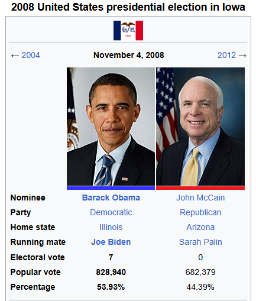

This is Part 3 of my summary of "Naked Economics: Undressing the Dismal Science". It covers more topics, including politics, globalization, trade, and development economics.

## Table of Contents

- [Chapter 8. The Power of Organized Interests](#chapter-8-the-power-of-organized-interests)
- [Chapter 9. Keeping Score](#chapter-9-keeping-score)

## Chapter 8. The Power of Organized Interests

In the previous chapters, the author has mentioned about "creative destruction", which is a term he uses to describe how technological advancements (the "creative" part), disrupt industries and its workers (the "destruction" part).

Now imagine that entire industry, all of its people come up and do what they can to prevent the implementation of the more efficient technology into their field, to avoid losing their jobs. [(Note 1)](#1)

That's what this chapter touches upon: how can a group of people, however small, affect change in the country. In other words, politics.

### An interesting case study

The author starts the chapter by talking about mohair farmers. Mohair is like wool, but it comes from the Angora goat, which looks like a sheep/goat hybrid.

Anyway, during the 1940's and 50's, there was a lot of tension in the world, a lot of wars (think WW2 and the Korean war (1950-1953)). Wool was used in uniforms. And half of all the wool used was imported in. So to lower their dependence on foreign fibers, the government created the National Wool Act in 1954, which is a subsidy for wool, and other types of similar fibers such as mohair. This subsidy lasted until 1993.

Obviously you're wondering, well what's the problem? The government didn't want to depend on on foreign imports, so they subsidize a domestic industry in order to "prompt it up".

The problem is that the military switched to using synthetic fibers in 1960. 

So allow me to recap: 
- 1940s: Military uses wool in uniforms.
- 1955: Mohair subsidy is created in order to promote domestic mohair production.
- 1960: Military stops using wool and mohair in uniforms.
- 1993: Wool/mohair subsidy is removed.

So now the big question: Why the hell was the subsidy in place for 33 years after the supposed reason for its creation no longer existed?

By the early 1990s, about 80% of domestic mohair was produced for export markets (this is what I read online). Meaning the US definitely didn't need all that mohair anymore.

Now you may say "Well everything with the government is just slow. It was just a matter of time before they removed this subsidy".

That may be true, but then explain why a similar subsidy came back in the 2008 Farm Bill, which included wool and mohair farmers as well.

Why are mohair farmers included yet again in this bill? Is there a powerful group of mohair farmers who are influencing congress?

Well, not at all. These are just regular farmers. In fact, it is precisely because there aren’t many of them that they’re able to secure these benefits. Here’s how it works:

Imagine 300 million Americans each paying a few extra cents in taxes. Those pennies are barely noticeable to the average person. However, for a small group of mohair farmers, these subsidies amount to tens of thousands of dollars per farmer. To the farmers, this is life-changing money. To everyone else, it’s too insignificant to raise concerns.

For politicians, this is a golden opportunity. Promise a policy that benefits a small, organized group like mohair farmers, and you’ve just secured their unwavering support. Now, multiply this by thousands of such niche groups: dairy farmers, wool farmers, peanut growers, etc. Each group gets its subsidy, and the politician gains millions of votes without facing much backlash. Why? Because for the average voter, these subsidies are just a rounding error in their tax bill.

This phenomenon highlights a fundamental quirk in democracy: small, concentrated groups with a lot to gain can wield disproportionate influence over policies. It’s a classic case of dispersed costs and concentrated benefits.

[This video](https://www.youtube.com/watch?v=mAsaE7LuiRU) is such a great summary of this exact situation. Watching this 3-minute clip will reinforce these topics in your head, and basically confirms most of what I wrote here.

### Whatever gets the votes

Next, the author talks about ethanol. (Just keep in mind that this book was published in 2013, so scientific data has probably evolved, however I did briefly look into it, mainly its the same).

Ethanol is a corn-based gasoline additive thought to be renewable and environmentally friendly. The gas we use in our cars, for example, actually is 10% ethanol.

The science backing ethanol is not very strong though. Some studies show it's less polluting, but others say that it evaporates faster than pure gasoline, contributing to ozone problems. To make ethanol, you have to grow corn, and corn farming has negative effects on the environment (due to land-use changes, due to runoff from fertilizer and pesticides, etc.). Also, there was an idea that using ethanol would decrease the US's reliance on foreign oil (this happened especially during the 1970s oil crisis). That was also shown to be an dubious theory. If you want to learn more about the science, you can [watch this video](https://www.youtube.com/watch?v=F-yDKeya4SU).

But, as was written in the New York Times in 2000 (during the 2000 presidential race), *"Regardless of whether ethanol is a great fuel for cars, it certainly works wonders in Iowa campaigns"*.

Bill Bradley was a senator from New Jersey who was known for opposing the ethanol subsidy. It seems he had looked into the data and found little backing for its claims. Good on him.

However, in 1992, Bill Bradley was running as a Democratic presidential candidate, and he visited Iowa. All of a sudden, he decided that he actually loves ethanol and wants to support the farmers involved in ethanol production.

What a coincidence. That in the crucial state of Iowa, a swing state (back then), where lots of people are corn-farmers, this candidate had a sudden change of heart on this matter. Definitely not a political strategy to pander to the voters.

Ever since, every single mainstream presidential candidate has supported the ethanol subsidy, except for one: John McCain. Notice how McCain was never the president. Obama, on the other hand, did support the ethanol subsidy. (I'm obviously not saying this is why Obama won in Iowa, but it could be one of many reasons).

So again, the theory is that a small, well-organized group, has lots of power politically, because the cost of whatever favor they may ask for is spread over a large, unorganized population.

### Teachers in the wrong

I love teachers, and think they should get compensated more, however this is not the way to go.

Every state requires public school teachers to get certain certificates. In Illinois, these requirements have steadily increased over time.

This seems like a good thing at first: we want potential teachers to be well-trained before teaching our children.

The problem is that current teachers don't have to jump through the same hoops. 

Well, if we are adding new training requirements with the supposition that this will benefit students, then the fact that current teachers don't also need to take the additional tests or certifications makes no sense. Think about it: you have a 25-year-old teacher who will be teaching for the next 40 years, while a 22-year-old aspiring teacher must complete more training than the 25-year-old had to just 2-3 years ago. If taking these extra courses or exams is necessary to be a good teacher, then presumably anyone standing at the front of the classroom should have to do them.

Moreover, the best teacher, with 20 years experience, coming from a private school, cannot teach at a public school.

In fact, there was a study done in California, and it showed that a. Good teachers matter, and b. certification has no correlation with how good a teacher is. The authors of this study recommended that states eliminate entry barriers so that talented people can become public school teachers. Most states are doing the opposite by adding more hoops to jump through.

The point is that there are many extra hoops, and this was done thanks to the teachers' union lobby. Why? Because current teachers have to worry less about their job being taken by future teachers entering the workforce. There is less supply of teachers and, as a result, less competition for current teachers. And that's what they want.

Furthermore, in the state of Illinois, electricians don't need to be licensed, but barbers and manicurists do. So my house can get burned down from a bad electrical job, but we cannot allow for my barber to be off by 1mm in my haircut. So, clearly, the danger level of a profession is not correlated with licensure. What is correlated with licensure is the political organization of a group. Groups seek to get themselves licensed. (Not saying that electricians are completely unregulated).

### Do not stop creative destruction

As a policymaker, you want to make sure you don't end up focusing your efforts on protecting methods and skills that are in decline. For example, if cigarette smoking has steadily decreased over the last 40 years, it makes sense to address the challenges faced by tobacco farmers whose livelihoods are threatened by this decline. The government should step in to assist them, but it should not aim to keep them in business.

Instead, funds collected from legal settlements with the tobacco industry could be used to compensate tobacco farmers and support their transition into other types of farming or entirely new industries. This approach provides meaningful help without trying to artificially sustain an industry that is shrinking for good reason.

The key is to recognize the importance of letting creative destruction take its course. By holding on to outdated practices simply to preserve the status quo, we risk stifling innovation and progress. Change can be challenging, but it is also essential for long-term growth. [(Note 2)](#2)

## Quotes from Ch.8

"In countries where farmers make up a small fraction of the population, such as America and Europe, the government provides large subsidies for agriculture. But in countries where the farming population is relatively large, such as China and India, the subsidies go the other way. Farmers are forced to sell their crops at below-market prices so that urban dwellers can get basic food items cheaply. [...] What makes these examples logically consistent is that in both cases the large group subsidizes the smaller group."

"The cost of [the mohair subsidy] is insignificant in the face of our $14 trillion economy. So is the ethanol subsidy. So is the trade protection for sugar producers, and the tax break for pharmaceutical companies with operations in Puerto RIco, and the price supports for dairy farmers. But in total, these things - and the tens of thousands of others like them - *are* signification. Little inefficiencies begin to disrupt the basic function of a market economy: taking inputs and producing goods and services as efficiently as possible. If the government has to support the price of milk, the real problem is that there are too many dairy farmers. [...] Governments should not be in the business of providing incentives for people to do things that would not otherwise make sense."

"Both politics and compassion suggest that we ought to offer a hand to those mowed over by competition. If some kind of wrenching change generates progress, then the pie must get bigger. And if the pie gets bigger, then at least some of it ought to be offered to the losers - be it in the form of transition aid, job retraining, or whatever else will help those who have been knocked over to get back on their feet. [...] There is a crucial distinction, however, between using the political process to build a safety net for those harmed by creative destruction and using the political process to stop that creative destruction in the first place. Think about the telegraph and the Pony Express. It would have been one thing to help displaced Pony Express workers by retraining them as telegraph operators; it would have been quite another to help them by banning the telegraph. Sometimes the political process does the equivalent of the latter for reasons related to the mohair problem. The economic benefits of competitions are huge but spread over a large group; the costs tend to be smaller but highly concentrated. As a result, the beneficiaries of creative destruction hardly notice; the losers chain themselves to their congressman's office door seeking protection, as any of us might if our livelihood or community were at risk."

## Chapter 9. Keeping Score

### Notes

#### 1

When ChatGPT came out, we quickly saw that some people were opposed to it. Obviously, all technology has its pros and cons, but that's when I learned about the Luddites.

A Luddite is someone opposed to new technology or new ways of working. The term is often used in a derogatory way today, but it has its roots in a real historical movement. The Luddites were English textile workers in the early 1800s who protested against industrial machines that threatened their jobs. They sabotaged looms and other machinery, trying to stop the changes that would disrupt their livelihoods. By 1812, machine-breaking was declared a crime punishable by death, and 17 men were executed the following year for their actions.

It is easy to dismiss them as people afraid of progress, but their livelihoods were at stake. When your way of life is under threat, it is hard to see the bigger picture. Over time, though, progress tends to benefit society, even if it forces painful changes along the way.

#### 2

After reading this chapter, I will say that being a politician is no simple task. It is easy to say, "Just do the right thing", but what does that mean sometimes?

Do you stand up to the ethanol lobby and risk losing Iowa, or do you support something you might not believe in because winning means you can do good elsewhere?

Every decision has trade-offs. Every choice comes with consequences, and there is always someone unhappy with what you do. It is not just about knowing what is right; it is about navigating the messy reality of how to make it happen without losing everything in the process.