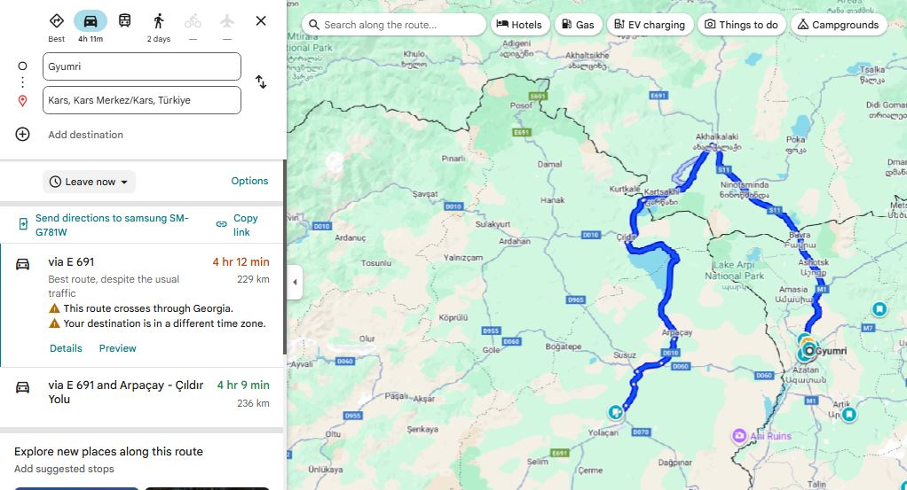
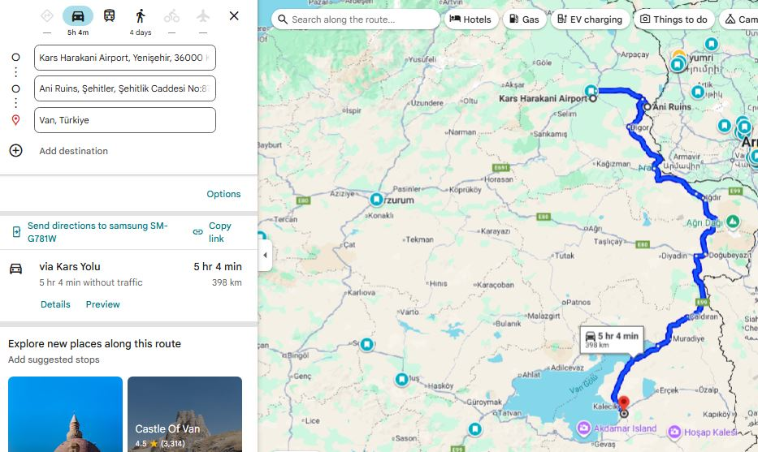
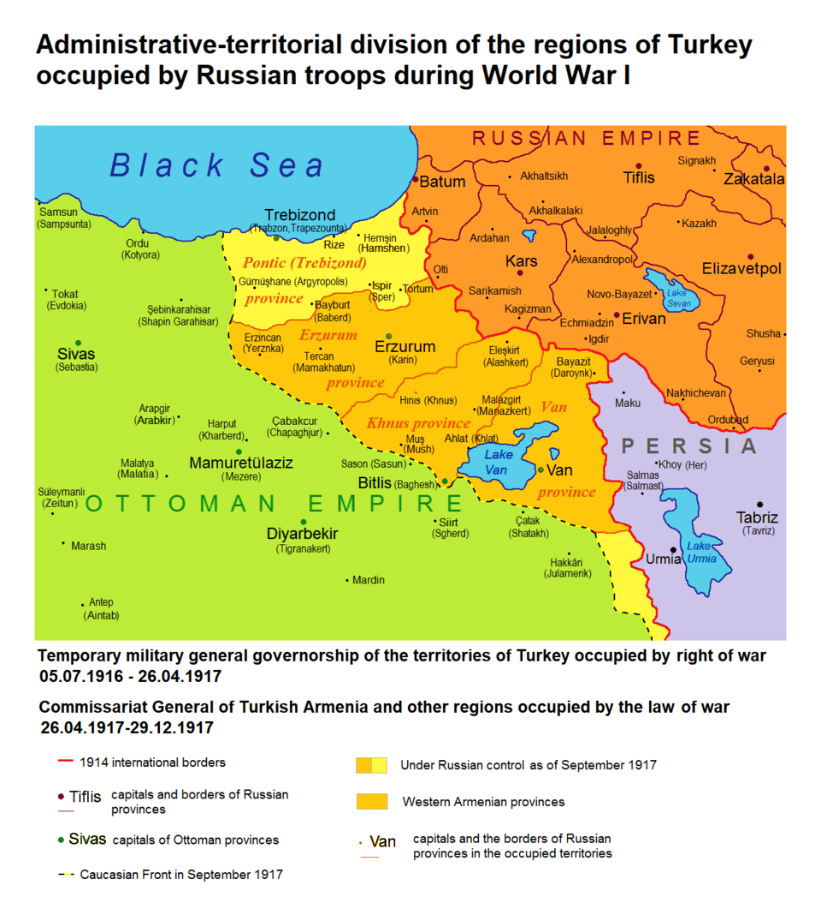

## Why I’m Writing This

First of all, I want to acknowledge something. What we saw on this trip will not last forever. If my great grandchildren visit eastern Turkey, they will find fewer traces of a past armenian presence than we did. The ruins will be fewer, the outlines fainter, and the carvings thinner. And some places will be completely gone. What can still be touched today may one day exist only in photographs and in the words of those who took the time to record it. An example of this is city names. [(Note 1)](#1)

And that is one reason I am writing this. Documenting this trip is a small form of preservation. And for the (over) 95% of Armenians from the diaspora who will never set foot in the villages their great grandparents fled from, all they have are stories like these. For them, these places exist only in black and white photographs and in documentaries.

I am not from these towns myself, but my friends are. And so we decided to go see them.

THe purpose of this trip was to see everything armenian. To see what the armenians have built, as well as the nature that they have seen. If there was beautiful nature along the way, we'd stop. If there was a beautiful mosque along the way, we'd stop. Because Turkey has a beautiful culture, despite ... (their denial, their dark past around which they (change)). ...!!!!!!!!!!!!!!!!!!!!!!!!!

## What Turkey Does Not Show You

Secondly, something I learned firsthand during this trip, is that Turkey does not invite you to notice the Armenian past. Often, all we had were Google Maps pins to follow, leading us to seemingly random places that felt like they were waiting to be repurposed or erased (probably through abandonment/neglect).

Signs point elsewhere, museums and official placards mention other empires, and any link with Armenians is conveniently omitted.

A fallen church is not just stones on the ground. It is a witness that can no longer testify.

Without these tangible reminders, the story of Armenians in these lands will rely more on written records and memory, both of which are easier to ignore and forget.

# Beginning our Trip

# Ani

_If you haven’t seen the Falcon Heavy, STOP READING and WATCH THIS._

test1 

<iframe width="560" height="315"
  src="https://youtu.be/A0FZIwabctw"
  title="Akhtamar boat ride"
  frameborder="0"
  allow="accelerometer; autoplay; clipboard-write; encrypted-media; gyroscope; picture-in-picture"
  allowfullscreen>
</iframe>

test



test short



It's funny because I name other places by their Turkish names followed by the Armenian names. And this would've happened here if the Turkish government would change the name Ani to Anı (pronunciation changes), which they apparently did consider/attempt doing. They would've said that "anı" means "memory" in Turkish, which would give it an easy symbolic undertone. But thankfully the name Ani is too entrenched in history. At this point it would draw too much negative attention to Turkey and would bring to light all the Turkification it has done to Armenian sites.

Ani was built during the era of Bagratid Armenia (885–1045 AD). Bagratid Armenia was a medieval Armenian kingdom founded by Ashot I Bagratuni, and it marked the first independent Armenian state after centuries of foreign rule (mostly Arab and Byzantine domination). Its capital moved around, but in 961 AD, Ani became the capital. Take a moment to look at [this very important and informative link of capitals of various Armenian kingdoms](https://en.wikipedia.org/wiki/Historical_capitals_of_Armenia).

At its peak, Ani had 100'000 inhabitants, rivaling Constantinople and Baghdad in beauty and wealth.

## The Trajectory

First of all, keep in mind this map:

.png)

Because you will 

We were picked up by our driver Tigran at 4:30AM from Gyumri, and got to the Turkish border at 7AM. 

We went through the armenian portion of Georgia, and I'll go on a little tangent about the Armenian portion of Georgia. [(Note 2)](#2)

Once we passed the Turkish border, we then called our taxi contact in Turkey, and left the border at 8AM (time zone shifts by an hour in Turkey). Anyway, we got to the Kars airport at 9AM (GMT+03:00), and waited until 10:30AM for Avis (car rental company) to give us our car. 

At 10:30AM we head to Ani, walk around for 3 hours (bring some water with you), and head toward Van. 

First of all, I highly recommend doing what [these guys did](https://www.youtube.com/watch?v=b3cJGvvnraU&list=PLcvSvkQpP-ACKxrp15AMdBDOT3BDUy36A&index=11&t=537), and that's go to check out [this church](https://artofwayfaring.com/destinations/khtzkonk-beskilise-monastery/) on the way to Van. Just be safe out there when hiking mountains, always be prepared for snakes or wild animals.

Another note on the way to Van is, I didn't really appreciate it in the moment, but the view of mount Ararat is the best from the city of Iğdır. Because you think that it'll get better, and you want to get behind Sis and Masis, but the behind is hidden by other mountains. So take a stop at/near Iğdır to look at Masis (the bigger of the two mountains).

Source: [https://ku.m.wikipedia.org/wiki/W%C3%AAne:I%C4%9Fd%C4%B1r_ve_A%C4%9Fr%C4%B1_Da%C4%9F%C4%B1.jpg]

Then we visited the island of Akhtamar.

## Cappadocia

I don't expect many people to know this, but Cappadocia was once inhabited by Armenians. I learned this during the trip itself when I started to zoom into Cappadocia on Google Maps, and started to notice churches. These were not Armenian churches, bu

It turns out that in 1021, the last king of Vaspurakan, Gagik Artsruni, handed the kingdom over to the Byzantine Empire in exchange for land in Cappadocia, due to pressure from Turkish invasions. 

## A Potential Future Trip

Let's look at this map again.

.png)

If you're goal is this follow "Armenianess", well then it's quite obvious that the southern portion is where you'd want to be. Going all to way to Adana, visiting Batman, Diyarbakır (Tigranakert), Mardin, Şanlıurfa (Urfa), Gaziantep and much more (which I'd have to research about) along the way.

Another potentially interesting trip could include traveling closer to the northern coastline of Turkey. The Hemshin Muslims in Rize (through Artvin I imagine) are an interesting group to visit as well.

### 1

Let's talk about names of cities. An obvious example to begin with is Istanbul, which used to be Constantinople, the City of (Roman Emperor) Constantine.

In 285 CE, the Roman Empire was divided in two for easier rule: one emperor in the East and one in the West. The Eastern Roman Empire became what we later call the Byzantine Empire, with Constantinople as its capital (named after Emperor Constantine in 330 CE). The Western Roman Empire collapsed in 476 CE, while the Eastern half survived another thousand years until it was captured by the Ottomans in 1453.

Greeks have always referred to Constantinople as “the city", and they have continued doing so when the Turks arrived. Over time, the Turks have heard countless times the phrase "εἰς τὴν Πόλιν" ("is tin pólin") which means "to the city" in Ancient Greek. In turkish pronunciation, that became Istanbul. By the nineteenth century, "Istanbul" was already widely used among Turks, while “Constantinople” remained in foreign and official documents.

After the fall of the Ottoman Empire in 1922, the new leader, Mustafa Kemal Atatürk carried out a wide set of modernization reforms. One of them was language reform. The Arabic script was abandoned and a Latin alphabet was introduced in 1928. Alongside this came the standardization of place names.

In 1930 the Turkish government formally asked the international community to use “Istanbul” instead of “Constantinople.” This was done through an official notice to foreign governments, embassies, and international postal services.

Okay, so that is the story of Istanbul. We could say this was a fairly natural change of names. The word Istanbul grew out of everyday speech, and Turks had already been using it for centuries. The government’s request in 1930 only made the rest of the world follow suit.

But not all name changes in Turkey happened so naturally. Under Sultan Abdul Hamid II in 1880, even the word “Armenia” was banned from schools, newspapers, and official records. The first name changes started when, in 1916, the minister of war, Enver Pasha, ordered that towns, villages, rivers, and mountains with Armenian, Greek, or Bulgarian names be replaced with Turkish ones.

After the Turkish Republic was founded in 1923, Mustafa Kemal Atatürk’s reforms continued the process. He even banned imported maps and non-Turkish street names in Istanbul were changed by 1927. In 1952, the Special Commission for Name Change was created and went on to change tens of thousands of names across the country. Mountains, rivers, streets, monuments, quarters and neighborhoods. Not to mention villages, towns and cities. And it's not just Armenian names of course. That geographic location is full of history, contributed by countless ethnic groups, including other muslim groups. It is agreed upon that thousands of Armenian, Greek, Kurdish, Arabic, Georgian, and Assyrian place names were officially changed over time. 

Kurds and other Muslim minorities were mostly exempt from name changes during the Ottoman Empire because the state presented itself as an Islamic caliphate (which just means that its led by a caliph, the successor of the Prophet Muhammad and the leader of all Muslims). But after the Ottoman Empire collapsed, and after Armenians and Greeks were eliminated, the pressure turned on them as well. During the genocide, many Kurdish tribes were promised land and property in return for helping in the massacres and deportations. Some benefited for a time, but once the new, secular and modern Turkish Republic was born, they too faced assimilation.

Here are some examples of the name changes:

- The Armenian island of Aghtamar (about the legend of Princess Tamar) became Akdamar (white vein). 
- Dikranagert (named after king Tigran), in 1937, was made into "Diyarbakır" (“land of copper” in Turkish). By the way, this city was known as "Amed" by Kurds and Assyrians. There is also claim that it used to be called "Diyar Bakr", meaning “land of the Bakr tribe,” used by Arabs from early medieval times. So Diyarbakır could just be its reinterpretation of that (nonetheless, they gave it a new meaning).
- Karin became Erzurum, which comes from Arabic Arz al-Rum (land of the Romans).
- Sepastia became Sivas.
- Kharpert became Harput, and the new city of Elazığ was built next to it.
- Erznka became Erzincan.
- Mount Masis, also known as Ararat, became Ağrı.
- The ancient city known to Greeks as Smyrna (destroyed in 1922) was renamed Izmir (again,  foreign governments were asked to adopt this new Turkish name).
- Georgian town of Vitz'e renamed to Fındıklı ("place with hazelnuts" in Turkish).

To reinforce this knowledge, you can see some of these here:

And here:

So as you can see, sometimes they tried to find similar words that meant something in Turkish, and make it seem like it was a gradual and natural change in language, adopted by the inhabitants. But in reality, it's been ordered one day to change. They tweak the sound and spelling into a Turkish form, keeping it recognizable and Turkifying it at the same time. The old identity gets quietly phased out, and over time, younger generations grow up thinking the Turkish form was the real name all along.

By the way, if you scroll down to the various maps [on this website](https://www.wikiwand.com/en/articles/Place_name_changes_in_Turkey#Greek), you will see which ethnicities lived where in Turkey. I highly encourage a quick look at it.

Now what about a place like Van? Van stayed Van, probably because Van was so ancient and tied to the ancient kingdom of Urartu, which Turks don't even believe are related to modern Armenians. And something like Nakhichevan? Nakhijevan means "first resting place" in Armenian, as it is thought that after landing on Mount Ararat, Noah first settled in the Nakhijevan area. Nakhichevan is one of the oldest continuously inhabited places in the region, mentioned by Greek, Persian, Armenian, and Arab historians for over two thousand years. So changing it outright would be a bit awkward, and what the Turks/Azeris say instead is that it's of ancient Turkic origin (Naxçıvan), rather than Armenian. And so they can say that, [destroy the tens of thousands of Armenian artifacts](https://en.wikipedia.org/wiki/Armenian_cemetery_in_Julfa), and claim continuity of their rule over that land. 

One last point I'll mention is that many of these places were called differently by the various minorities present in the region, such as Dikranagert/Amed. But the point is that these names were passed down through generations of natives and bear thousands of years of history, while the new name (Diyarbakir) was made up by a committee in an office to obscure history and attempt to cover up a century of ethnic cleansing.

Renaming a place is the last step of a cycle that's happening even today. Azerbaijan recently captured the Armenian territory of Artsakh, and they will now make sure that everybody follows suit with their names. Google Maps used to have Stepanakert, capital of Artsakh, but now it only has Khankendi. 

Destroy, erase, rename, repeat.

[Return](#why-im-writing-this)

### 2

The region called Javakheti, in Georgia, is majority Armenian (50%+). Towns like Akhalkalaki and Ninotsminda are 95%+ Armenian.

That region has been historically Armenian for centuries. It was part of many Armenian kingdoms (I'm not good at this but it can be traced back to the Urartians from the 9th–6th century BCE. And if you don't consider the Urartians as Armenians, then there's the Orontid Dynasty, which is considered the first Armenian dynasty, from the 6th–2nd century BCE). So ever since then, there were Armenians living in those lands; throughout Mongol, Persian, Ottoman, and finally Russian rule.

Especially after the 1828 Russo-Turkish War, when the Russians took the territory from the Ottomans, many Armenians fled the Ottoman Empire into that region, and settled there permanently.

Fast forward to 1917, when the Russian Empire collapsed. At that point, this was the map of the Russian Empire:

Georgia declared its independence on May 26, 1918, and the First Republic of Armenia declared it on May 28, 1918.

Javakheti's population was overwhelmingly Armenian at that point, but when the Russian forces retreated, Georgian troops swiftly went in and took control. The Armenian locals weren't happy, but Armenia couldn’t do anything about it; it was busy fighting the Ottoman invasion of May–June 1918 (which included the famous Battle of Sardarabad in May 21-29). If Armenia had lost that battle, there may not have been an Armenia at all. 

So Georgia in a way took advantage of that situation, and also ended up taking the region of Lori (they claimed that region based on the fact that it was part of the georgian Kingdom of Kartli-Kakheti, which existed before the Russian annexation, from 1762 to 1801). In December 1918, there was a short "war" for Lori and Javakheti regions (both of which had Armenian-majority populations.).

The Javakheti region was actually included in the Armenian proposals for the Treaty of Sevres of 1920, but since the purpose of the treaty was to split up the Ottoman Empire, and Javakheti was part of the former Russian Empire, that claim was ignored.

Anyway, in 1920-1921, the Red Army invaded both countries, and now it was the ultimate time to decide who gets what. We know Karabakh was given to the Azerbaijanis, and we also know that Javakheti belongs to Georgia today, and Lori belongs to Armenia.

Why did the Soviets give Javakheti to the Georgian SSR? Well, one reason is that before the Russian Empire annexed Georgia, that land did belong to the Georgian Kingdom of Kartli-Kakheti. Secondly, just like with Karabakh, the Soviets wanted to intentionally mix ethnic groups across internal republic borders (a classic imperial tactic used to prevent unified nationalism and to create dependence on central authority). Thirdly, and probably most importantly, the Georgian SSR was a larger republic, with more resources, access to the Black Sea, and natural mountain barriers separating it from the Ottomans. So giving Javakheti to Georgia was a strategic move by the Soviets to secure loyalty from the Georgians.

[Return](#the-trajectory)