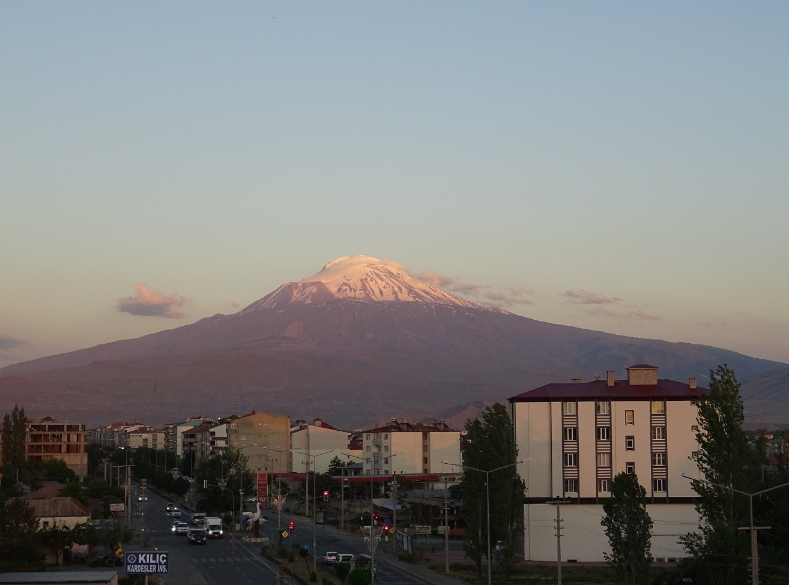
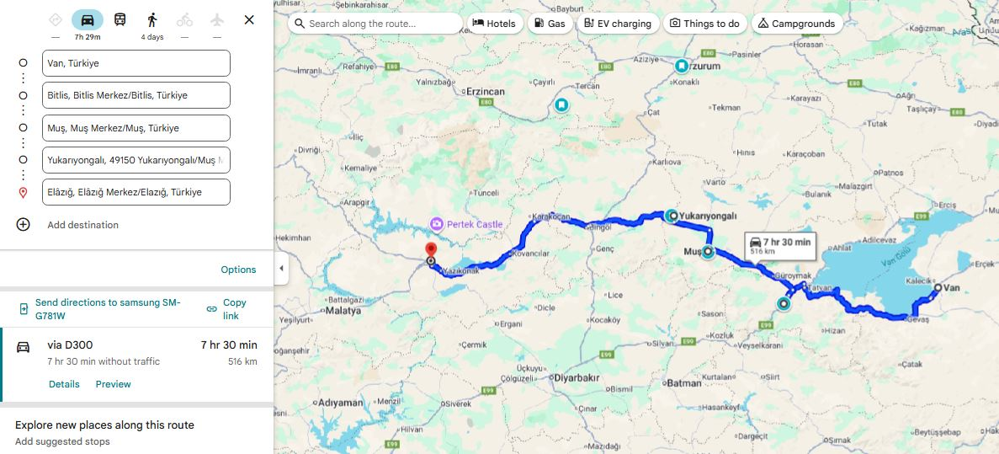
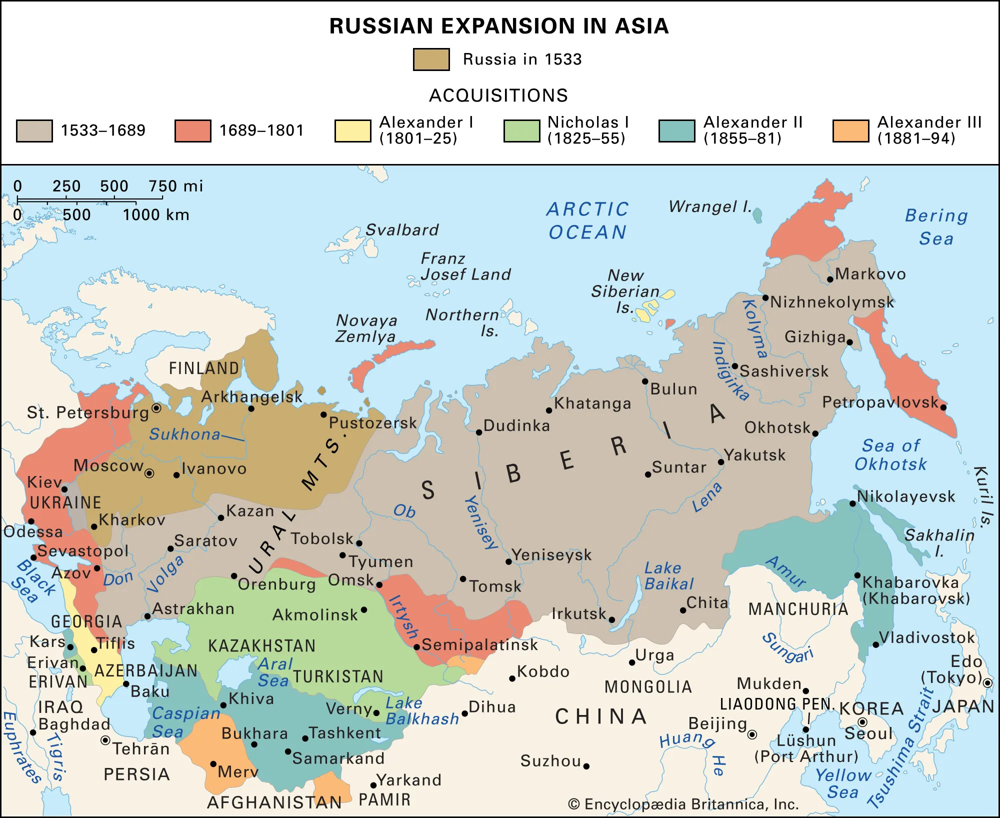

## Why I’m Writing This

First of all, I want to acknowledge something. What we saw on this trip will not last forever. If my great grandchildren visit eastern Turkey, they will find fewer traces of a past armenian presence than we did. The ruins will be fewer, the outlines fainter, and the carvings thinner. And some places will be completely gone. What can still be touched today may one day exist only in photographs and in the words of those who took the time to record it. An example of this is city names. [(Note 1)](#1)

By the way, even today the Azerbaijan government continues this pattern. President Ilham Aliyev and state media regularly refer to Armenian cities and regions using Azerbaijani or Turkic names, even when those places are internationally recognized as part of Armenia, such as Lake Sevan (which they call Lake Goycha), and Yerevan (which they call Irevan). This is done under the pretense that Armenians live on historically Azerbaijani land. And unfortunately without international law, disputes like these are not settled by history or truth, but by strength.

And that is one reason I am writing this. Documenting this trip is a small form of preservation. And for the (over) 95% of Armenians from the diaspora who will never set foot in the villages their great grandparents fled from, all they have are stories like these. For them, these places exist only in black and white photographs and in documentaries.

I am not from these towns myself, but my friends are. And so we decided to go see them.

The purpose of this trip was to simply see everything Armenian. To walk where Armenians once walked, to stand among the stones they placed, and to witness the landscapes that once surrounded their homes. If there was beautiful nature along the way, we stopped. If there was a beautiful mosque, we stopped. Because Turkey is a beautiful country, and it holds a rich culture, even if that culture rests on a foundation that refuses to acknowledge its past.

## What Turkey Does Not Show You

Secondly, something I learned firsthand during this trip, is that Turkey does not invite you to notice the Armenian past. Often, all we had were Google Maps pins to follow, leading us to seemingly random places that felt like they were waiting to be repurposed or erased (probably through abandonment or neglect).

Signs point elsewhere, museums and official placards mention other empires, and any link with Armenians is conveniently omitted.

A fallen church is not just stones on the ground. It is a witness that can no longer testify.

Without these tangible reminders, the story of Armenians in these lands will rely more on written records and memory, both of which are easier to ignore and forget.

# Beginning our Trip

## The Trajectory

First of all, keep in mind this map:

.png)

As Armenians we intuitively know this map, because we hear from our surroundings "my father's side is from Bitlis", "my maternal grandmother's side is from Kars", "my grandparents are both from Mush", etc. 

And here is the trajectory:

Here is the approximate destinations we went to:

Gyumri, Kars, Ani, Iğdır, Van, Akthamar Island, Bitlis, Muş, Yukarıyongalı (tiny Zaza village), Elâzığ, Harput, Malatya, Gürün, Kayseri, Ürgüp (Cappadocia), Gürün, Kemah Gorge, Erzincan, Erzurum, Kars, Akhalkalaki, Gyumri.

I will not go into everything here, but I'll come notes about the trip:

We had a driver take us to the Georgian-Turkish border

We went through the armenian portion of Georgia, and I'll go on a little tangent about the Armenian portion of Georgia. [(Note 2)](#2)

Once we passed the Turkish border, we then called our taxi contact in Turkey, and left the border at 8AM (time zone shifts by an hour in Turkey). Anyway, we got to the Kars airport at 9AM (GMT+03:00), and waited until 10:30AM for Avis (car rental company) to give us our car.

First of all, I highly recommend doing what [these guys did](https://www.youtube.com/watch?v=b3cJGvvnraU&list=PLcvSvkQpP-ACKxrp15AMdBDOT3BDUy36A&index=11&t=537), and that's go to check out [this church](https://artofwayfaring.com/destinations/khtzkonk-beskilise-monastery/) on the way to Van. Just be safe out there when hiking mountains, always be prepared for snakes or wild animals.

Another note on the way to Van is, I didn't really appreciate it in the moment, but the view of mount Ararat is the best from the city of Iğdır. Because you think that it'll get better, and you want to get behind Sis and Masis, but the behind is hidden by other mountains. So take a stop at/near Iğdır to look at Masis (the bigger of the two mountains).

Source: [https://ku.m.wikipedia.org/wiki/W%C3%AAne:I%C4%9Fd%C4%B1r_ve_A%C4%9Fr%C4%B1_Da%C4%9F%C4%B1.jpg]

While staying in Van, we visited the island of Akhtamar, ... 

When visiting Akhtamar, we had these churches on our list but I guess we spent too much time in Akhtamar, since we spontaneously decided to swim there after seeing others doing so.

You feel extremely greasy from the lake, and at first we thought it's because they dump some industrial waste into the water or something, but turns out that that is the natural chemical composition of that lake. It's what is known as a soda lake, which is any lake with a pH of between 9 and 12. It's just rich in particular salts which makes the water highly alkaline (Lake Van has a pH of 9.7), and when our skins touches these salts, and leaves a soapy feeling. As long as you don't have any cuts on your skin, and you shower afterwards, there is no problem.

For fun I checked what would happen if you were to drink the water from Lake Van. If you take a few sips, your stomach acid (pH ~ 1.5-3.5) would immediately neutralize it.

Bitlis
Muş
Yukarıyongalı

We spent two nights in Van, and headed towards Elazig, where we had the hotel booked for one night. On the way there we stopped at Mush, and a small village called Yukariyongali. We drove past the lake XYZ, where tens of thousands of armenians were killed during the genocide, It was a top 3 killing ground.

The next day, from Elazig we drove to the village of Gurun, where we slept for 4 days. On one of the days we went Westward to Kayseri and Cappadocia. 

Next we stopped in middle of Erzincan and Erzurum, in Grand Karagul Hotel for 2 nights.

We spent the final night in Kars. 

# Ani

It's funny/sad because I name other places by their Turkish names followed by the Armenian names. And this would've happened here if the Turkish government would change the name Ani to Anı (pronunciation changes), which they apparently did consider/attempt doing. They would've said that "anı" means "memory" in Turkish, which would give it a symbolic undertone. But thankfully the name Ani is too entrenched in history. At this point it would draw too much negative attention to Turkey and would bring to light all the Turkification it has done to Armenian (and others such as Greek and Arab) sites.

Ani was built during the era of Bagratid Armenia (885–1045 AD). Bagratid Armenia was a medieval Armenian kingdom founded by Ashot I Bagratuni, and it marked the first independent Armenian state after centuries of foreign rule (mostly Byzantine and Arab domination). Its capital moved around, but in 961 AD, Ani became the capital. Take a moment to look at [this very important and informative link of capitals of various Armenian kingdoms](https://en.wikipedia.org/wiki/Historical_capitals_of_Armenia).

[At its peak](https://en.wikipedia.org/wiki/Ani#/media/File:Bagratuni_Armenia_1000-en.svg), Ani had potentially 100'000 inhabitants, rivaling Constantinople and Baghdad in beauty and wealth. At this point I should note also that although it is named "the city of 1001 churches", it didn't actually have that many. As [Wikipedia](https://en.wikipedia.org/wiki/Ani) has it, "to date, 50 churches, 33 cave chapels and 20 chapels have been excavated by archaeologists and historians".

In 1045 AD, Ani was surrendered without much resistance to the Byzantine Empire, who wanted this front to defend against the Seljuks.

In 1064 AD however, the Seljuks captured Ani and many inhabitants were killed or enslaved, and much of the city was destroyed. This was the start of the decline of Ani. (This conquest played a significant role in the movement of Armenian into Cilicia, which was officially established as a principality in 1080 AD, and was a full-on kingdom between 1198 and 1375.)

Then in 1072, the Seljuks transferred Ani to the Shaddadids, a Muslim Kurdish dynasty, as a vassal state. The Seljuk Empire was already enormous, stretching from Iran into Anatolia, and they had no interest in directly administering every distant frontier city. Instead, they entrusted Ani to a loyal local dynasty to rule it on their behalf and defend it against Byzantines and Georgians. The Shaddadids held Ani until 1199, ruling over a still largely Armenian city in which Armenian, Kurdish, and Muslim elites shared power, administration, and at times intermarried.

Afterwards, the Georgians took control, and encouraged Armenians to settle back. They even let Armenian nobles rule (Zakarid princes).

Ultimately, it all came down in 1236 AD after the Mongols entered Ani during their expansion into the Caucasus. Unlike the Seljuk's, who massacred tens of thousands, Mongols often took cities for taxation. To be exact, they stormed Ani, killed many defenders, and looted churches and homes. Then, they imposed heavy taxes on the survivors instead of wiping the city out.

The city faced further damage from a significant earthquake in 1319, which further contributed to its decline. By the 15th–17th centuries, Ani was largely abandoned. Small Kurdish, Persian, and Turkish communities lived among the ruins.

What do we see there today? The most significant is the Cathedral of Ani (989–1001), designed by Trdat the Architect, or Trdat Chartarapet (Տրդատ Ճարտարապետ) in Armenian. Its dome collapsed in an earthquake in 1319 and it has stood roofless ever since, but today scaffolding surrounds it as part of Turkey’s restoration project at Ani.

It should be noted however that these restorations are controversial. Critics argue that Turkey often presents Armenian monuments in ways that dilute or obscure their origins, sometimes rebranding them with Turkish names or emphasizing later Islamic phases while downplaying their Christian Armenian identity. For example, they had proposed to use the Ani Cathedral as a mosque, which people see as part of a broader pattern of cultural erasure rather than neutral preservation.

Trdat the Architect became famous when the Byzantine emperor Basil II invited him to lead the reconstruction of Hagia Sophia’s central dome in Constantinople after it was damaged by an earthquake in 989. It was one of the greatest engineering challenges of the medieval world, and his success made him famous far beyond Armenia, with his methods studied and imitated for centuries.

## Akhtamar

Akhtamar is an island in Lake Van

The Cathedral of the Holy Cross on Akhtamar was built between 915 and 921 by [King Gagik I Artsruni](https://en.wikipedia.org/wiki/Gagik_I_Artsruni), King of Vaspurakan (908 - 1021). (Note that this is a different king from [Gagik I Bagratuni](https://en.wikipedia.org/wiki/Gagik_I_of_Armenia), king of Bagratuni. This was a period of many Armenian states, ruled by different Armenian dynasties, and Vaspurakan was one of those, along with Syunik, Artsakh, and idk what else potentially).

As a sidenote, take a look at some of the art on the walls of the Akhtamar Church depicting [King Gagik I Artsruni](https://en.wikipedia.org/wiki/Gagik_I_Artsruni).

It was the seat of an independent Armenian Catholicosate from the 10th until 1895. This fact is a big deal, because there have only been three Catholicosates in the history of Armenia: Etchmiadzin, Akhtamar, and later, Cilicia. Just like the Byzantine Empire had multiple Patriarchates like in Constantinople, Antioch, Alexandria, and Jerusalem, each governing a region but recognizing a shared theological framework, the Armenian Church followed a similar logic.

Today we only have one Catholicos for all Armenians, seated at Mother See of Holy Etchmiadzin. He is the supreme head of the Armenian Apostolic Church worldwide. Technically there is a second one, but he is second in rank, so it's not the same. I'm talking about the Catholicos of the Great House of Cilicia, seated in Antelias, Lebanon. (https://www.armenianorthodoxchurch.org/en).

Before I explain why, it's important to know the following:

After the fall of the Bagratid kingdom and later the Seljuk invasions, Armenian political life shifted westward. When Armenians established the Armenian Kingdom of Cilicia, the Catholicos of All Armenians physically moved there in the 11th century.

Similarly, after the Armenian Genocide, the majority of Armenians lived outside modern Armenia. The Cilician Catholicosate became the most effective structure for Lebanon, Syria, Cyprus, Iran, etc.

If you are interested to learn more, I think this is an [amazing website](https://www.armenianorthodoxchurch.org/en/the-armenian-church/history).

Anyway, regarding the Akhtamar church, Turkey closed the it in 2005 for restoration, and reopened it in 2007 as a museum. A cross was initially not allowed on top, caused backlash from Armenians worldwide. The cross was finally added in 2010 after international pressure.

You can read more about it on its [wikipedia page](https://en.wikipedia.org/wiki/Cathedral_of_the_Holy_Cross,_Aghtamar).

## Erzincan 

## Cappadocia

I don't expect many people to know this, but Cappadocia was once inhabited by Armenians. I learned this during the trip itself when I started to zoom into Cappadocia on Google Maps while we were driving there, and started to notice churches. These were not Armenian churches, but it's still a hint. So I started to dig deeper.

First, the basic thing about Cappadocia that makes the rest of this story possible:

The region is made of soft volcanic tuff (the same tuff that Armenians like to build their buildings with). Volcanoes in the region laid down layers of ash and rock, which got compressed over time. Then erosion (wind, water and gravity) carved it into those shapes people call fairy chimneys. The important point is the tuff is soft enough to carve with hand tools, but stable enough to hold shape if you carve it properly. That means you can carve houses, storage rooms, churches, monasteries, tunnels, and entire underground complexes. 

So what did this region go through, historically?

Although smaller farming communities lived there before, the earliest known major civilization in the region were the Hittites (c. 1700–1200 BCE). 

You could see in [this video](https://www.youtube.com/watch?v=bs03z0Lsu9g), if you fastforward to approximately the year 1700BC, that the Hittite Empire, even though we've never heard of it, was one of the largest of its time. 

Then the Hittite Empire fell, and the land continued to be inhabited by local communities.

Then the Persian Achaemenid Empire (c. 550 to 330 BCE) arrived and gobbled up that area and the people living there. It turns out that this area was renowned for its horse breeding and supplying the Persian empire with its horses. Because off this, this area was given the name Katpatuka, which in ancient Persian mean “land of beautiful horses”. It was just another satrapy ("province") which they arbitrarily drew lines on a map in order to administer for tax and organization purposes. Katpatuka also had local elites who were under imperial oversight.  

Then the Greeks adapted it into Kappadokia, and Romans into Cappadocia. So the name that reaches us is filtered through Persian administration and Greek writing.

As per [Wikipedia](https://en.wikipedia.org/wiki/Achaemenid_Empire), "[in] 330 BC, amidst a military campaign that began in 336 BC, the Achaemenid Empire was conquered in its entirety by Alexander the Great, who annexed it to his Macedonian Empire. Upon Alexander's death, which sparked the beginning of the Hellenistic period in 323 BC, the majority of the former Achaemenid Empire's territories came under the rule of the Seleucid Empire and the Ptolemaic Kingdom."

But the satrapy of Katpatuka (which was by then known as Καππαδοκίας (Kappadokia) in Greek, or Cappadocia as the Romans would write it) quickly gained independence and became the Kingdom of Cappadocia (330 BCE to 17 CE). For many of those years, it wasn't an independent kingdom though, but often a vassal or client state, either of the Seleucid Empire, or later the Roman Republic, and then the Roman Empire (starting in 27BC).

In 17 CE, Rome annexed Cappadocia and turned it into the province of Cappadocia.

From then on, it was no longer a kingdom, but it remained a clearly defined region in Roman and Byzantine maps for centuries. And after the Romans, it fell into the hands of other smaller kingdoms, until the Seljuks and Ottomans took it to themselves.

### Where Armenians Fit Into Cappadocia

And that is a summary of the history of Cappadocia as a region. Now the question is where Armenians fit into this picture, because if you are walking through Cappadocia today, the number of churches is striking. There are far more churches carved into the rock here than in most parts of Turkey. That alone tells you that this was a heavily Christian region for some time.

This is where we have to start looking into the underground world of Cappadocia. While the Hittites were probably carving early underground structures for food storage and hiding valuables, it is possible that at the end of that empire, and the post-Hittite fragmented communities would start expanding the underground spaces to hide from raids and attacks (which became more common now that there is no central government), but it was very short term and at a small scale. No giant, permanent, underground cities yet. Just "emergency cities" used to evade danger.

Same thing during the Persian and Hellenistic periods (c. 550 BC to 200 CE).

At some point though, Christianity spreads to the people of that region, and since the Roman Empire only legalized Christianity under Emperor Constantine in 313, the early Christians expanded the underground space to build underground chapels and hidden worship spaces. So here we see the start of these spaces being used as organized community shelters, and being used for longer periods of time, so they also had to include ventilation shafts and even wells. Once Christianity was legalized, the community started carving churches outside, making them visible, which are some of the ones we can visit today in that region (such as the Tokalı Kilise, or Buckle Church, in Göreme).

But the underground spaces which were already carved out turned out especially useful with the approach of the Muslims (think c. 650 to 950). The Arab Caliphates of Rashidun, Umayyad, and Abbasid armies raided Anatolia repeatedly, and Cappadocia happened to be at the forefront of that sometimes. And this is where the huge underground cities like Derinkuyu and Kaymaklı grew to hold thousands of people with a dozen levels of layers going down. Archaeologists estimate that Derinkuyu (the deepest and most complex one) could shelter about 15'000 to 20'000 people, plus animals and food stores. And there are dozens of such (but smaller) underground cities in Cappadocia.

And it turns out that in 1021, the last king of Vaspurakan (the kingdom centered around lake Van, 908 - 1021), the son of King Gagik I Artsruni (who I mentioned earlier in the Akhtamar section), Senekerim-Hovhannes Artsruni, handed his kingdom over to the Byzantine Empire in exchange for lands further west, including in Cappadocia. This decision came under increasing pressure from Seljuk advancements from the east and the weakening ability of Armenian kingdoms to defend their borders independently.

And this situation gives us a glimpse into how empires behave, which you can read more about if interested in the note. [(Note 3)](#3)

Anyway, in 1071 the [Battle of Manzikert](https://en.wikipedia.org/wiki/Battle_of_Manzikert) happens. The Seljuks defeat the Byzantines, and Byzantine control of Anatolia begins to weaken. From this point on, there was no more "frontier chaos", no more unpredictability. Random raids were replaced with (relatively) stable taxation, and so the underground systems slowly stopped being cared for and maintained, until, a few generations later, they just became abandoned cavities.

This battle is a popular and important one, because regions that had felt like the interior of the empire suddenly start to feel exposed. Roads become unsafe. Anatolia is no longer a stable area.

But long before 1071, the Byzantine Empire had been deliberately resettling Armenians into Cilicia and nearby regions. From the tenth century onward, Armenian soldiers, nobles, and their families were moved into southern Anatolia as part of Byzantine military and administrative policy. The empire used Armenians to garrison frontier zones, guard mountain passes, and stabilize regions that were difficult to control directly. This meant that by the early eleventh century, Armenian communities already existed in Cilicia, with churches, estates, and local networks.

And with the Battle of Manzikert, there was one last push of Armenians toward Cilicia (I have to mention it wasn't a one-time event, but rather a multi-decade transition). It looked attractive not only because Armenian communities were already established there, but also because it offered access to the Mediterranean (to enable trade and connection), protection from the Seljuks through the Taurus Mountains, and fertile land.

Once enough manpower has been gathered, Armenian leaders in Cilicia begin to turn this demographic and military presence into political control. They seize fortresses and take control of mountain passes. Eventually, a new Armenia, the Armenian Kingdom of Cilicia (1198 - 1375), was formed.

So, to conclude, although Cappadocia was never an Armenian kingdom, and it was never a core Armenian homeland, it became a place of settlement, refuge, and transition for them. Just as any Christian group would've found solace in those lands and underground cities.

## Erzurum and the case of the Armenian-Turkish relations library

We weren't prepared to debate, but next time I'd like to keep the following ideas in mind:

1. Have Armenians ever lived in Nakhichevan. How were there khachkars then in Jugha? Do you think it was right to destroy them? Why?

## A Potential Future Trip

Let's look at this map again.

.png)

If you're goal is this follow "Armenianess", well then it's quite obvious that the southern portion is where you'd want to be. Going all to way to Adana, visiting Batman, Diyarbakır (Tigranakert), Mardin, Şanlıurfa (Urfa), Kahramanmaraş, Gaziantep and much more (which I'd have to research about) along the way. 

And if you do go in this direction, an absolute must is the village of Vakıflı, as well as the mountain nearby. The population is 100-150, and they are mostly ethnically Armenian, and they speak Western Armenian (and Turkish). And if you look close by on the map, you will see that Mount Musa is nearby. The same mountain on which 4000 Armenians from 7 villages took arms and resisted the Ottomans for 53 days until they were rescued by the French. This was during the Armenian Genocide by the way, and there's a famous book that talks about it called The Forty Days of Musa Dagh by Franz Werfel.

Anyway, those rescued Armenians were taken to a refugee camp in Port Said, Egypt. After WW1, as part of the Treaty of Sèvres of 1920, that area which is today Turkey's Hatay Province, was part of the French-administered Syrian territory. And since it was now controlled by the French, those Armenian refugees went back to their homes around Mount Musa (not only, since it was estimated that 11% of Hatay's 220'000 population was Armenian, and ~40% were Turks). Mustafa Kemal Atatürk claimed that Hatay was Turkish and should be part of the new Republic of Turkey, and the French wanted to secure Turkey's neutrality before WW2, allowed the creation of a transitional country called Hatay State, which existed between between September 1938 and June 1939. Anyway, Hatay State was annexed by Turkey, and so since 1939 it's part of Turkey. And once that happened, most Armenians left (especially to Anjar, Lebanon), and only some families in Vakıflı stayed. And today's 100-150 inhabitants of Vakıflı are the descendents of those people who went back and never left.

Another potentially interesting trip would include traveling closer to the northern coastline of Turkey. The Hemshin Muslims in Rize and Artvin are an interesting group to learn about as well. They were Armenians who converted to Islam during the Ottoman rule. The name comes from the region of Hemshin, or Hemşin, near Rize. According to [this source](https://en.wikipedia.org/wiki/Hem%C5%9Fin), there was the Armenian price Hamam in the 8th century who led a group of Armenians up north from the Arab invasions in Vaspurakan. And he named city Hamamshen, meaning "Hamam's hamlet" in Armenian. So that's where today's Hemşin name comes from, and they even speak an Armenian dialiect called [Homshetsi](https://en.wikipedia.org/wiki/Homshetsi_dialect), but it's complicated because one language was turkified, and then some eastern part speak something closer to Armenian. Worth exploring if interested.

### 1

Let's talk about names of cities. An obvious example to begin with is Istanbul, which used to be Constantinople, the City of (Roman Emperor) Constantine.

In 285 CE, the Roman Empire was divided in two for easier rule: one emperor in the East and one in the West. The Eastern Roman Empire became what we later call the Byzantine Empire, with Constantinople as its capital (named after Emperor Constantine in 330 CE). The Western Roman Empire collapsed in 476 CE, while the Eastern half survived another thousand years until it was captured by the Ottomans in 1453.

Greeks have always referred to Constantinople as “the city", and they have continued doing so when the Turks arrived. Over time, the Turks have heard countless times the phrase "εἰς τὴν Πόλιν" ("is tin pólin") which means "to the city" in Ancient Greek. In turkish pronunciation, that became Istanbul. By the nineteenth century, "Istanbul" was already widely used among Turks, while “Constantinople” remained in foreign and official documents.

After the fall of the Ottoman Empire in 1922, the new leader, Mustafa Kemal Atatürk, carried out a wide set of modernization reforms. One of them was language reform. The Arabic script was abandoned and a Latin alphabet was introduced in 1928. Alongside this came the standardization of place names.

In 1930 the Turkish government formally asked the international community to use “Istanbul” instead of “Constantinople.” This was done through an official notice to foreign governments, embassies, and international postal services.

Okay, so that is the story of Istanbul. We could say this was a fairly natural change of names. The word Istanbul grew out of everyday speech, and Turks had already been using it for centuries. The government’s request in 1930 only made the rest of the world follow suit.

But not all name changes in Turkey happened so naturally. Under Sultan Abdul Hamid II in 1880, even the word “Armenia” was banned from schools, newspapers, and official records. The first name changes started when, in 1916, the minister of war, Enver Pasha, ordered that towns, villages, rivers, and mountains with Armenian, Greek, or Bulgarian names be replaced with Turkish ones.

After the Turkish Republic was founded in 1923, Mustafa Kemal Atatürk’s reforms continued the process. He even banned imported maps and non-Turkish street names in Istanbul were changed by 1927. In 1952, the Special Commission for Name Change was created and went on to change tens of thousands of names across the country. Mountains, rivers, streets, monuments, quarters and neighborhoods. Not to mention villages, towns and cities. And it's not just Armenian names of course. That geographic location is full of history, contributed by countless ethnic groups, including other muslim groups. It is agreed upon that thousands of Armenian, Greek, Kurdish, Arabic, Georgian, and Assyrian place names were officially changed over time. 

Kurds and other Muslim minorities were mostly exempt from name changes during the Ottoman Empire because the state presented itself as an Islamic caliphate (which just means that its led by a caliph, the successor of the Prophet Muhammad and the leader of all Muslims). But after the Ottoman Empire collapsed, and after Armenians and Greeks were eliminated, the pressure turned on them as well. During the genocide, many Kurdish tribes were promised land and property in return for helping in the massacres and deportations. Some benefited for a time, but once the new, secular and modern Turkish Republic was born, they too faced assimilation.

Here are some examples of the name changes:

- The Armenian island of Aghtamar (about the legend of Princess Tamar) became Akdamar (white vein). 
- Dikranagert (named after king Tigran), in 1937, was made into "Diyarbakır" (“land of copper” in Turkish). By the way, this city was known as "Amed" by Kurds and Assyrians. There is also claim that it used to be called "Diyar Bakr", meaning “land of the Bakr tribe,” used by Arabs from early medieval times. So Diyarbakır could just be its reinterpretation of that (nonetheless, they gave it a new meaning).
- Karin became Erzurum, which comes from Arabic Arz al-Rum (land of the Romans).
- Sebastia became Sivas.
- Kharpert became Harput, and the new city of Elazığ was built next to it.
- Erznka became Erzincan.
- What Armenians know as Kesaria, which comes from the Roman "Caesarea", is today known as Kayseri.
- Mount Masis, also known as Ararat, became Ağrı.
- The ancient city known to Greeks as Smyrna (destroyed in 1922) was renamed Izmir (again,  foreign governments were asked to adopt this new Turkish name).
- Georgian town of Vitz'e renamed to Fındıklı ("place with hazelnuts" in Turkish).

To reinforce this knowledge, you can see some of these here:

And here:

So as you can see, sometimes they tried to find similar words that meant something in Turkish, and make it seem like it was a gradual and natural change in language, adopted by the inhabitants. But in reality, it's been ordered one day to change. They tweak the sound and spelling into a Turkish form, keeping it recognizable and Turkifying it at the same time. The old identity gets quietly phased out, and over time, younger generations grow up thinking the Turkish form was the real name all along.

By the way, if you scroll down to the various maps [on this website](https://www.wikiwand.com/en/articles/Place_name_changes_in_Turkey#Greek) or the corresponding [wikipedia page](https://en.wikipedia.org/wiki/Place_name_changes_in_Turkey), you will see which ethnicities lived where in Turkey. I highly encourage a quick look at it.

Now what about a place like Van? Van stayed Van, probably because Van was so ancient and tied to the ancient kingdom of Urartu, which Turks don't even believe are related to modern Armenians. And something like Nakhichevan? Nakhijevan means "first resting place" in Armenian, as it is thought that after landing on Mount Ararat, Noah first settled in the Nakhijevan area. Nakhichevan is one of the oldest continuously inhabited places in the region, mentioned by Greek, Persian, Armenian, and Arab historians for over two thousand years. So changing it outright would be a bit awkward, and what the Turks/Azeris say instead is that it's of ancient Turkic origin (Naxçıvan), rather than Armenian. And so they can say that, [destroy the tens of thousands of Armenian artifacts](https://en.wikipedia.org/wiki/Armenian_cemetery_in_Julfa), and claim continuity of their rule over that land. Unfortunately for them, this part of history is recent enough that it is [well documented from outside sources](https://archive.archaeology.org/online/features/djulfa/).

One last point I'll mention is that many of these places were called differently by the various minorities present in the region, such as Dikranagert/Amed. But the point is that these names were passed down through generations of natives and bear thousands of years of history, while the new name (Diyarbakir) was made up by a committee in an office to obscure history and attempt to cover up a century of ethnic cleansing.

Renaming a place is the last step of a cycle that's happening even today. Azerbaijan recently captured the Armenian territory of Artsakh, and they will now make sure that everybody follows suit with their names. Google Maps used to have Stepanakert, capital of Artsakh, but now it only has Khankendi. 

Destroy, erase, rename, repeat.

[Return](#why-im-writing-this)

### 2

The region called Javakheti, in Georgia, is majority Armenian (50%+). Towns like Akhalkalaki and Ninotsminda are 95%+ Armenian.

That region has been historically Armenian for centuries. It was part of many Armenian kingdoms (I'm not good at this but it can be traced back to the Urartians from the 9th–6th century BCE. And if you don't consider the Urartians as Armenians, then there's the Orontid Dynasty, which is considered the first Armenian dynasty, from the 6th–2nd century BCE). So ever since then, there were Armenians living in those lands; through Mongol, Persian, Ottoman, and finally Russian rule.

Especially after the 1828 Russo-Turkish War, when the Russians took the territory from the Ottomans, many Armenians fled the Ottoman Empire into that region, and settled there permanently.

Fast forward to 1917, when the Russian Empire collapsed. At that point, this was the map of the Russian Empire:

Georgia declared its independence on May 26, 1918, and the First Republic of Armenia declared it on May 28, 1918.

Javakheti's population was overwhelmingly Armenian at that point, but when the Russian forces retreated, Georgian troops swiftly went in and took control. The Armenian locals weren't happy, but Armenia couldn’t do anything about it; it was busy fighting the Ottoman invasion of May–June 1918 (which included the famous Battle of Sardarabad in May 21-29). If Armenia had lost that battle, there may not have been an Armenia at all today. 

So Georgia in a way took advantage of that situation, and also ended up taking the region of Lori (they claimed that region based on the fact that it was part of the georgian Kingdom of Kartli-Kakheti, which existed before the Russian annexation, from 1762 to 1801). In December 1918, there was a short "war" for Lori and Javakheti regions (both of which had Armenian-majority populations.).

The Javakheti region was actually included in the Armenian proposals for the Treaty of Sevres of 1920, but since the purpose of the treaty was to split up the Ottoman Empire, and Javakheti was part of the former Russian Empire, that claim was ignored.

Anyway, in 1920-1921, the Red Army invaded both countries, and now it was the ultimate time to decide who gets what. We know Karabakh was given to the Azerbaijanis, and we also know that Javakheti belongs to Georgia today, and Lori belongs to Armenia.

Why did the Soviets give Javakheti to the Georgian SSR? Well, one reason is that before the Russian Empire annexed Georgia, that land did belong to the Georgian Kingdom of Kartli-Kakheti. Secondly, just like with Karabakh, the Soviets wanted to intentionally mix ethnic groups across internal republic borders (a classic imperial tactic used to prevent unified nationalism and to create dependence on central authority). Thirdly, and probably most importantly, the Georgian SSR was a larger republic, with more resources, access to the Black Sea, and natural mountain barriers separating it from the Ottomans. So giving Javakheti to Georgia was a strategic move by the Soviets to secure loyalty from the Georgians.

[Return](#the-trajectory)

### 3

Byzantium wanted to absorb Armenian kingdoms without constantly fighting them. Territory is best taken through negotiation. But once you absorb a kingdom, you also inherit the problem of defending it. Eastern Anatolia is long, mountainous, and expensive to secure. So relocating a local king and his elite westward is a way to neutralize an independent power base on the frontier (this classic imperial strategy is explained next) and bring loyal Christian populations into regions where the empire can control and protect them more easily.

An independent power base means a local ruler, with land and soldiers and a loyal population, operating on the edge of an empire, where the empire's grip is weakest. Because if politics change, they can switch sides, rebel, or negotiate with the enemy. So relocating a local king and his elite westward was a way to dismantle an independent power base on the frontier without open war. The population becomes integrated into Byzantine society, where they are welcomed. The Armenian army is broken and integrated into the Byzantine army. The Armenian nobility become imperial landholders, retaining status, rank and honor. All they lost was the ability to act independently.

So relocation creates dependency, integration, and loyalty to imperial structures. This is very clean. 

And Cappadocia is one of those interior regions. It is better connected. It is safer than the extreme frontier. It already has Byzantine administration and military infrastructure. So placing them there benefits imperial stability. 

By the way, the Byzantines weren't doing charity work and just providing refuge for the Armenians from future Seljuk attacks. And Armenians were not random peasants in this context. Armenians had been integrated into Byzantine military and administration for centuries. Many Armenian nobles served the empire. They were valuable as soldiers and as organized communities. So resettlement is not only about removing them from danger. It is also about placing them where they benefit imperial stability.

[Return](#where-armenians-fit-into-cappadocia)